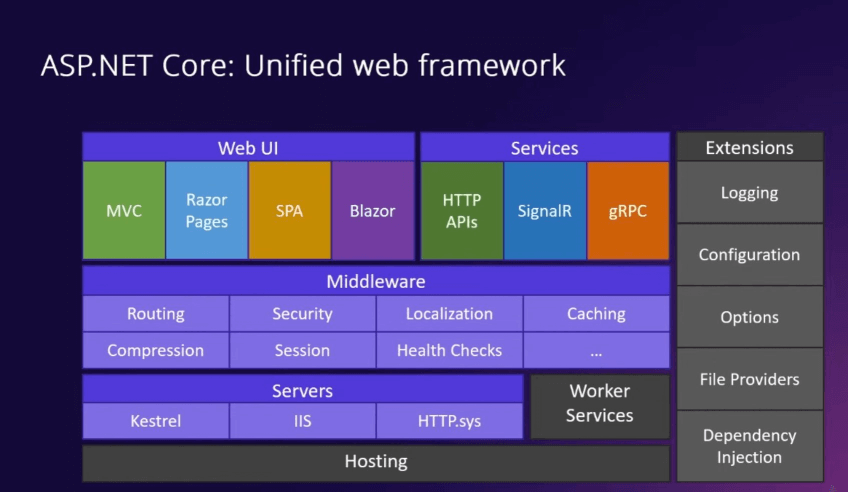
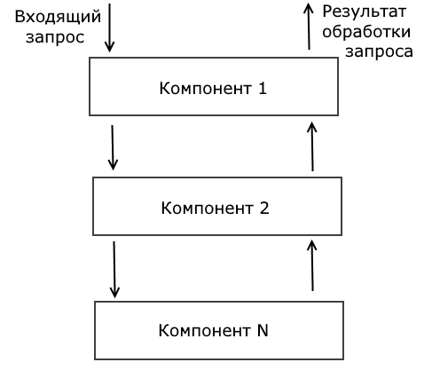

# ASP.NET Core

Технология для создания веб-приложений на базе .NET. В ней куча разных технологий.



На картинке есть слои:
1) верхний - взаимодействие с пользователем: MVC, Razor Pages (шаблон html), Single-Page-Application (одностраничные, с использованием React, Angular, Vue), Blazor
2) ...

Сам **ASP.NET** - база для веб разработки: маршрутизация, конфигурация, логирование, работа с БД.

**ASP.NET Core Web API** - реализация паттерна REST.

**Blazor** - интерактивный фреймворк для написания интерактивных штук, в том числе на стороне клиента через WebAssembly.

## База

В проекте:
* Dependencies - библиотеки
* Properties - настройки проекта
* `launchSettings.json` - настройки запуска (например, ардес)
* `appsettings.json` - конфигурация
* `appsettings.Development.json` - конфигурация для разработки

---

Роль строки `<Project Sdk="Microsoft.NET.Sdk.Web">` и SDK:

SDK (Software Development Kit) - набор инструмантов: компилятора, библиотек, документации, дебаггера и прочее для работы с языком, фреймворком, платформой, технологией и тп. (тут важно, что речь не только про язык).

**Microsoft.NET.Sdk.Web** - это непосредственно sdk для ASP.NET Core: **Razor Pages**, **MVC**, **Web API**.

## Начало работы
В начале нужно создать основной класс (одновременно с этим настроив его) - `WebApplication`.

Он создается с помощью фабрики `WebApplicationBuilder`.

```cs
var builder = WebApplication.CreateBuilder(args);
var app = builder.Build();
app.MapGet("/", () => "Page stuff");
app.Run();

// можно еще так:
WebApplicationOptions options = new() { Args = args };
WebApplicationBuilder builder = WebApplication.CreateBuilder(options);

// прикольная херня:
app.UseWelcomePage();
```

Интерфейсы для настройки приложения `WebApplication`:
* `IHost`: для запуска и остановки хоста, который прослушивает входящие запросы
* `IApplicationBuilder`: для установки компонентов, которые участвуют в обработке запроса
* `IEndpointRouteBuilder`: для установки маршрутов, которые сопоставляются с запросами

Свойства класса `WebApplication`:
* `Configuration`: представляет конфигурацию приложения в виде объекта `IConfiguration`
* `Environment`: представляет окружение (среда, условия работы, настройки, переменные, зависимости, инфраструктура) приложения в виде `IWebHostEnvironment`
* `Lifetime`: позволяет получать уведомления о событиях жизненного цикла приложения
* `Logger`: представляет логгер приложения по умолчанию
* `Services`: представляет сервисы приложения
* `Urls`: представляет набор адресов, которые использует сервер

Запуск:
```cs
app.Run();
app.RunAsync();
app.Start();
app.StartAsync();
app.StopAsync();
```

То есть можно написать так:
```cs
await app.StartAsync();
await Task.Delay(10000);
await app.StopAsync(); // через 10 сек завершить
```
## Конвеер обработки запросов

**middleware** - компоненты конвеера обработки запроса.

Устройство как у сети как таковой:



middleware настраивается через интерфейс `IApplicationBuilder` (его как раз реализует `WebApplication`) с помощью методов-расширений `Run*`, `Use*`, `Map*`.

Создание компонента `middleware` - создание метода. В частности, можно использовать 

`public delegate Task RequestDelegate(HttpContext context)`

Сервер при получении запроса формирует объект `HttpContext` - в нем вся необходимая инфа о запросе (свойства):

* `Connection`
* `Features`
* `Items` - пары ключ-значение
* `Request` - `HttpRequest` - информация о запросе.
* `RequestAborted` - прервано ли подключение = закончить ли обработку
* `Response` - отвечает за ответ на запрос.
* `RequestServices` - `IServiceProvider`- предоставляет доступ к контейнеру сервисов запроса
* `Session` - информация о текущей сессии
* (!) `TraceIdentifier` - уникальный идентийикатор запроса для трассировки
* `User` - информация о том кто послал запрос
* `WebSockets` - объект для управления веб сокетами

### Встроенные компоненты
* **Authentication**: предоставляет поддержку аутентификации (проверка что пользователь тот за кого себя выдает)
* **Authorization**: предоставляет поддержку авторизации (проверка, что пользователь может делать то, что просит)
* **Cookie Policy** - отслеживает согласие пользователя на хранение связанной с ним информации в куках
* **CORS** - политика безопасности: может ли мой фронтенд делать звпросы на другой сайт. Для этого браузер должен спросить у моего сервера можно ли так делать.
* **DeveloperExceptionPage** - страница ошибки во время разработки
* **Diagnostics** - набор middleware, который предоставляет страницы статусных кодов, функционал обработки исключений, страницу исключений разработчика
* **Forwarded Headers** - перенаправление заголовков
* **Health Check**
* **MVC** - функционал MVC
* **HTTP Logging**
* **Request Localization**
* **Response Caching**
* **Endpoint Routing**
* ...

### Добавление компонента:
```cs
// добавление финального компонента:
app.Run(async (context) => await context.Response.WriteAsync("Hello METANIT.COM"));
app.Run(); // не путать, это другой Run
```

#### Свойство Response объекта HttpContext
*Cвойства:*
* `Body`: получает или устанавливает тело ответа в виде объекта Stream
* `BodyWriter`: возвращает объект типа PipeWriter для записи ответа
* `ContentLength`: получает или устанавливает заголовок Content-Length
* `ContentType`: получает или устанавливает заголовок Content-Type
* `Cookies`: возвращает куки, отправляемые в ответе
* `HasStarted`: возвращает true, если отправка ответа уже началась
* `Headers`: возвращает заголовки ответа
* `Host`: получает или устанавливает заголовок Host
* `HttpContext`: возвращает объект HttpContext, связанный с данным объектом Response
* `StatusCode`: возвращает или устанавливает статусный код ответа

*Методы:*
* `Redirect()`: выполняет переадресацию (временную или постоянную) на другой ресурс
* `WriteAsJson()/WriteAsJsonAsync()`: отправляет ответ в виде объектов в формате JSON
* `WriteAsync()`: отправляет некоторое содержимое. Одна из версий метода позволяет указать кодировку. Если кодировка не указана, то по умолчанию применяется кодировка UTF-8
* `SendFileAsync()`: отправляет файл

```cs
// Код статуса
app.Run(async(context) =>
{
    context.Response.StatusCode = 404;
    await context.Response.WriteAsync("Resource Not Found");
});

// Отправка html
app.Run(async (context) =>
{
    var response = context.Response;
    response.ContentType = "text/html; charset=utf-8";
    await response.WriteAsync("<h2>asasassa</h2>");
});
```

Понятно можно отправлять очень много всего.
Вот показательный код для демонстрации `Request`:

```cs
app.Run(async (context) =>
{
  context.Response.ContentType = "text/html; charset=utf-8";
  var stringBuilder = new System.Text.StringBuilder("<table>");

  foreach (var header in context.Request.Headers)
  {
    stringBuilder.Append($"<tr><td>{header.Key}</td><td>{header.Value}</td></tr>");
  }

  stringBuilder.Append($"<tr><td>Cookies:</td><td>{context.Request.Cookies}</td></tr>");
  stringBuilder.Append($"<tr><td>Host:</td><td>{context.Request.Host}</td></tr>");
  stringBuilder.Append($"<tr><td>Path:</td><td>{context.Request.Path}</td></tr>");

  stringBuilder.Append($"<tr></tr>");
  stringBuilder.Append($"<tr><td>Key</td><td>Value</td></tr>");
  foreach (var param in context.Request.Query)
  {
    stringBuilder.Append($"<tr><td>{param.Key}</td><td>{param.Value}</td></tr>");
  }
  stringBuilder.Append("</table>");
  await context.Response.WriteAsync(stringBuilder.ToString());
}
```

Отправка файла с помощью интерфейса `IFileInfo`:
```cs
app.Run(async (context) =>
{
    var fileProvider = new PhysicalFileProvider(Directory.GetCurrentDirectory());
    var fileinfo = fileProvider.GetFileInfo("forest.jpg");
 
    context.Response.Headers.ContentDisposition = "attachment; filename=my_omage.jpg";
    await context.Response.SendFileAsync(fileinfo);
});
```

### Отправка форм
Речь про 
```html
<form method="post" action="register">
  <p>Name: <input name="name" /></p>
  <p>Age: <input name="age" type="number" /></p>
  <p> <!-- массив значений -->
    Languages:<br />
    <input name="languages  " /><br />
    <input name="languages" /><br />
    <input name="languages" /><br />
  </p>
  <p>
    Weathers:<br />
    <select multiple name="weather">
      <option>rain</option>
      <option>sad rain</option>
      <option>disgusting rain</option>
      <option>selfharmfull rain</option>
      <option>rainless rain</option>
    </select>
  </p>
  <input type="submit" value="Send" />
</form>
```

Пример обработчика:
```cs
app.Run(async (context) => {
  context.Response.ContentType = "text/html; charset=utf-8";

  if (context.Request.Path == "/register") {
    IFormCollection form = context.Request.Form;
    string name = form["name"];
    string age = form["age"];
    string[] langs = form["languages"];
    await context.Response.WriteAsync($"<div><p>Name: {name}</p><p>Age: {age}</p></div>");
  }
});

```

### Перенаправление
```cs
context.Response.Redirect("/my/path");
context.Response.Redirect("https://entirely_foreign_site.com")
```

### Отправка и получение JSON - сериализация и десеариализация
https://metanit.com/sharp/aspnet6/2.10.php
```cs
public record Person(string Name, int Age);

// автоматическая десериализация:
var person = await request.ReadFromJsonAsync<Person>();
if (person != null) // удалось сконвертировать
  message = $"Name: {person.Name}  Age: {person.Age}";
```

### Use, UseWhen
`Map` - финальный компонент конвеера, перед ним можно настроить еще компоненты

добавление нового компонента:
```cs
app.Use(async (context, next) =>
{
    // действия перед передачей запроса в следующий middleware
    await next.Invoke();
    // Либо это, для обратной совместимости (не нужно):
    await next.Invoke(context);
    // действия после обработки запроса следующим middleware
});
```

Нюанс: согласно документации, не рекомендуется делать так:

```cs
Use:
await context.Responce.WriteAsync(...)
next.Invoke()
->
Run:
await context.Responce.WriteAsync(...)
```

### UseWhen == MapWhen
Настраивает конвеер чуть по-друому, поэтому второй аргумент - тоже лямбда, чтобы он ее там как надо вызвал:
```cs
app.MapWhen(
  context => context.Request.Path == "/time",
  appBuilder => appBuilder.Run(async context => {
    var time = DateTime.Now.ToShortTimeString();
    await context.Response.WriteAsync($"current time: {time}");
  })
);
```

### Map
Создание нового sub-конвеера:
```cs
app.Map("/path/aaa", app => {
  app.Use(...)
});
```

Пример, в котором дизъюнктивно либо about, либо index, либо home, либо page not found:
```cs
app.Map("/home", appBuilder =>
{
    appBuilder.Map("/index", Index); // middleware для "/home/index"
    appBuilder.Map("/about", About); // middleware для "/home/about"
    // middleware для "/home"
    appBuilder.Run(async (context) => await context.Response.WriteAsync("Home Page"));
});
 
app.Run(async(context) => await context.Response.WriteAsync("Page Not Found"));
 
app.Run();
 
void Index(IApplicationBuilder appBuilder)
{
    appBuilder.Run(async context => await context.Response.WriteAsync("Index Page"));
}
void About(IApplicationBuilder appBuilder)
{
    appBuilder.Run(async context => await context.Response.WriteAsync("About Page"));
}
```

### Классы middleware
Суть в том что эти 1 кода 1 в 1 эквивалентны:
```cs
// Класс middleware
public class TimingMiddleware
{
    private readonly RequestDelegate _next;

    public TimingMiddleware(RequestDelegate next)
    {
        _next = next;
    }

    // or Invoke, no async
    public async Task InvokeAsync(HttpContext context)
    {
        var startTime = DateTime.UtcNow;
        
        await _next(context); // передача запроса дальше
        
        var elapsedMs = (DateTime.UtcNow - startTime).TotalMilliseconds;
        Console.WriteLine($"Запрос {context.Request.Path} выполнен за {elapsedMs} мс");
    }
}

// Регистрация в Startup/Program.cs
app.UseMiddleware<TimingMiddleware>();
```

и этот код:

```cs
app.Use(async (context, next) => 
{
    var startTime = DateTime.UtcNow;
    
    await next(); // передача запроса дальше по конвейеру
    
    var elapsedMs = (DateTime.UtcNow - startTime).TotalMilliseconds;
    Console.WriteLine($"Запрос {context.Request.Path} выполнен за {elapsedMs} мс");
});
```

### IWebHostEnvironment 
- информация об окружении
- например, `ApplicationName`, `IsDevelopment("Test")`
- информация из launchSettings.json
```cs
app.Environment
```


