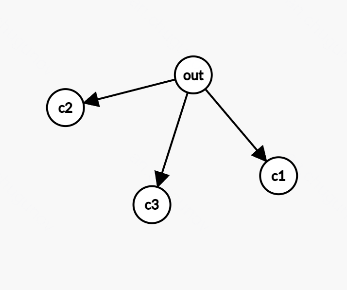
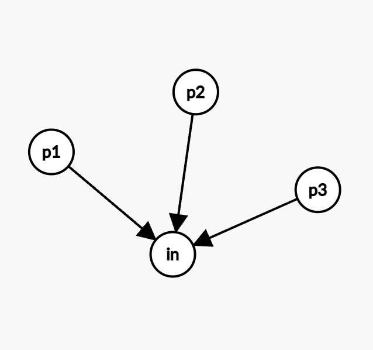

# Некоторые заметки о C#

## Работа с датой и временем
- `DateOnly` - точка во времени: только дата 
- `DateTime` - точка во времени: дата + время (с учетом временного пояса)
- `DateTimeOffset` - точка во времени: дата + время + смещение, которое учитывает часовйо пояс
- `TimeSpan` - диапазон времени

## Среда исполнения
- CLR - среда выполнения кода `.NET`. В ней есть GC, умеет загружать dll, использует JIT компилятор.
- Стандартный процесс компиляции кода на C#: код -> IL (он же CIL и MSIL) -> машинный код
    - Код в IL преобразует компилятор до запуска приложения, IL в машинный код преобразуется **лениво** JIT компилятором во время исполнения
    - Из всего вышеперечисленного, только JIT - платформенно-зависимый

## Модификаторы доступа
- `private`, `public`, `protected` - см. java, С++
- `internal` - доступен только в рамках одного проекта (.csproj)
- `protected internal` - доступен в рамках одного проекта и наследникам (= `internal` OR `protected`)
- `private protected` - доступен наследникам, но только в рамках одного проекта (= `internal` AND `protected`)
- `sealed` - аналогичен `final` в java (не может быть наследован)

## `StringBuilder`
Нельзя же писать `for(...) s += ...` - это `O(nm)`. Для подобных нужд существует "изменяемая строка" - `StringBuilder`.

Основные операции:
- `Append()`, `AppendLine x = Append (x + "\n")`
- `Remove()`, `Insert()`, `Replace()` - работают как и полагается долго

## `virtual`, `override`, `new`
- пара `virtual` + `override` - нужна для наследования классов (в интерфейсах не нужно). Подразумевает создание виртуальной таблицы функций, в которую лезет исполнитель при вызове объекта с учетом RTTI.
- `new` - статическое переопределение метода. В наследуемом классе метод, помеченный `new`, скроет метод родителя - как бы определение нового метода, просто пересеклись названия; Не сказывается на `override` и `virtual`, в рантайме нет лишнего оверхеда. Никогда лучше не использовать.

## IEnumerable
- гарантирован однократный проход по коллекции
Интерфейс: `GetEnumerator` -> IEnumerator, у того методы: `Current`, `bool MoveNext()`, `void Reset()` (Reset, конечно же, устаревший, почти всегда notSupportedException)
- IAsyncEnumerable - все методы async. Используется так: `await foreach(...)`

## Null values
- проверка на null - с .NET 8 (предупреждения и прочее)
- Аннотации:
    - `[NotNull]` - после исполнения метода значение не null.
    - `[NotNullWhen(true)]` - если true, то не null
    - `[DoesNotReturn]`, `[DoesNotReturnIf(condition)]` - метод не возвращается из исполнения (например кидает ошибку или в цикле или еще что-то)
    - `[MemberNotNull]` - гарантирует, что поле не null после исполнения метода
    - `[DisallowNull]` - не допускает null в качестве аргумента, даже если как бы допускает
    - `[MaybeNull]`, `[MaybeNullWhen(bool)]` - помечает, что может быть null, даже если не nullable

## boxing + unboxing
Ну есть такая странная возможность в C# - преобразовывать значимые и значимые типы
```cs
int i = 10;
object o = i; // boxing
int j = (int)o; // unboxing (требует именно int, long - ошибка)
```

## ref/out/in
Для передачи поссылке:
```cs
void fr(ref int value) {
  value = 10b;
}
void fi(in int value) {
  sout(value);
}
void fo(out int value) {
  value = 10b;
}
...
int xr = 1;
int xi = 1;
int xo;
fr(ref xr); // read + write value
fi(in xi); // read value
fo(out xo); // write value
```

Важно понимать, что `ref` - почти бесполезен для классов, `in` - полностью бесполезен для классов. `out` - в основном для `TryGet(out T value)` паттерна.

`in` - очень полезен для работы со структурами, иногда может быть заменен на `ref`. Тут ситуация как со ссылками в С++ и с указателями в Go (почти всегда используются именно указатели).

## GC
**Живой (reachable)** — объект, на который есть хотя бы одна активная ссылка из "корней".

**Мёртвый (unreachable)** — объект, до которого нельзя добраться из корней.

**Корни** - источники поиска живых объектов (локальные переменные, статические поля, параметры методов, регистры, ...)


Поколения: 0, 1, 2, 3. Идея: большинство объектов живет недолго, а те, кто уже пожил, проживут дольше.

Gen0 - быстрое выделение памяти и быстрая очистка, выжившие объекты отправляются в Gen1. Пара МБ.

Gen1 - сюда двигаются объекты, пережившие очистку Gen0. Реже происходит сборка.

Gen2 - долгоживущие. Много памяти (порядок гигабайтов)

Gen3/LOH (Large Object Heap)

## IDisposable, IAsyncDisposable
- есть метод для удаления объекта (не влияет на сборку мусора, только спец метод)

Есть устойчивый паттерн использования:

```cs
class Resource : IDisposable
{
  private bool disposed = false;

  // Есть управляемый ресурс:
  private Stream stream;

  // Есть неуправляемый ресурс:
  // ???

  public void Dispose() {
    Dispose(true);
    GC.SuppressFinalize(this); // Не вызывать финализатор
  }

  protected virtual void Dispose(bool disposing) {
    if (!disposed) {
      if (disposing) {
        // Освобождаем управляемые ресурсы
        fileStream?.Dispose();
      }
      // Освобождаем неуправляемые ресурсы (если есть)
      disposed = true;
    }
  }

  ~Resource() {
    Dispose(false); // Только неуправляемые ресурсы
  }
}
```

`IAsyncDisposable` - метод `Dispose` асинхронный, важно иметь в виду при работе с IO!!!

По-хорошему всегда использовать с using и не заниматься странной финализацией, так как это всегда плохо.

## Вызов конструкторов
- всегда сначала родительский, в том числе когда вызывается через `: base()`.
- если говорить про делегирование конструкторов, то нужно писать `: this(...)` - так как можно только в самом начале конструктора вызвать другой конструктор.

## Ковариантность, контрвариантность и нафига такие невнятные слова сюда приплетать
- Ковариантность - можно использовать более конкретные типы (ребенка вместо родителя)
- Контрвариантность - можно использовать более общие типы (родителя вместо ребенка)
- Инвариантность - можно использовать только указанный тип

Обозначения соответственно:
- `out` - ковариантность
- `in` - контрвариантность
- инвариантность без обозначения




## [Коллекции](collections.md)

## IComparable, IEquatable, IComparer
```cs
object.ReferenceEquals(x, y) // Сравнение ссылок
object.Equals(x, y) // Сравнение значений (IEquatable)
x.Equals(y) // Сравнение значений (IEquatable)
x == y // зависит от того, перегружен ли operator==

x.CompareTo(y) // Сравнение значений (IComparable)
x < y // зависит от того, перегружен ли operator<
```

Не забывать про `GetHashCode()`.

## IO потоки
- `FileStream` - для записи-чтения из файла, допускает асинхронность, но ее надо включить флагом isAsync. Работает и для записи и для чтения. Нужен для R/W бинарных файлов
- `MemoryStream` - поток из RAM, неплох, чтобы мокать поведение реального IO. В остальном кажется бесполезным
- `StreamReader`, `StreamWriter` - чтение и запись для текстовых файлов.
- `Console.In` - стрим для чтения из стандартного потока


