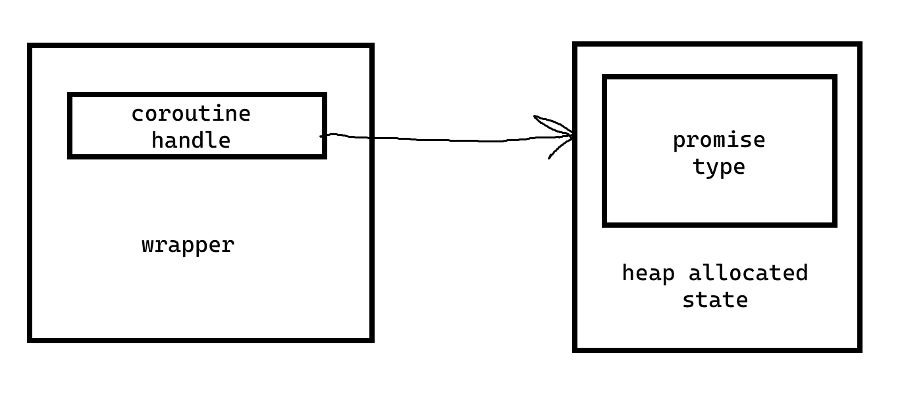

# Корутины

```cpp
#include <generator> // newest versions of compilers

generator<int> generate_squares() {
  int i = 0;
  for (;;) {
    co_yield i * i;
    ++i;
  }
}

int main() {
  generator<int> gs = generate_squares();
  auto it = gen.begin();
  std::cout << *it << "\n";
  +it;
  std::cout << *it << "\n";
  // ...
}
```

Корутины - присотанавливаемые функции.
Помогают более естественно писать асинхронный код.

## Stackfull корутины
В C++ только stackless. Для stackfull требуется, чтобы после приостановки из стеке ничего не убиралось и она продолжалась дальше после следующего вызова.

В разных ОС есть аналоги этого.
* Win32 Fibers
* POSIX ucontext. makecontext, swapcontext.
* Boost context (в каком-то смысле)

## Stackless корутины
Идея: компилятор перепишет код как структуру с методом `resume()`. Примерно как Range в dlang/лямбда со статическими переменными.

Проблемы:
* Почему просто структура не совсем хорошо: есть оптимизации вроде inlining.
* Непонятно как делать рекурсию в stackless
* Полученный класс нельзя копировать и перемещать.
* Этот класс нельзя создавать на стеке. Надо в куче. Потому что иногда нужно чтобы корутина жила больше чем какой-то блок {}. Простыми словами, у нее кастомное время жизни.
* Класс должен быть type-erased. Почему: ну как с function, есть единый интерфейс, и не наследуемся от одного класса (все равно не будет без оптимизаций статического полиморфизма).
* ? Пример почему _type-erased_: read_some должен уметь вызывать разные корутины
* Можно считать, что state корутины лежит на стеке, а указатель на него - _type-erased_. На самом деле компилятор скорее всего сделает оптимизации на этот счет.

Устройство корутины:



* _coroutine handle_ - изкоуровневая вещь. Скорее всего пользоваться придется оберткой: _coroutine type_ (на картинке "wrapper").
* В случае с `generator` это просто `coroutine_handle<promise_type>` + операции (у него это `begin`, `end`).
* Надо что-то от себя добавить в _state_: _promise type_ - он знает что сейчас было yielded.
* _promise type_ обязан быть (так в С++), но он может быть пустой.

Пример:
```cpp
generator<int> test() {
  co_yield 20;
  co_yield 30;
}

generator<int> test_rewritten() {
  struct heap_alloc_state {
    generator<int>::promise_type promise;
    // ...
  };

  heap_alloc_state* state = new heap_alloc_state();
  generator<int> res = state->promise.get_return_object(); // то что на самом деле хотим вернуть
  // ...
  return res;
}

// как примерно выглядит get_return_object():
struct generator::promise {
  generator get_return_object() {
    return generator(
      coroutine_handle<generator::promise>
        ::from_this(this)
    );
  }
}
```
* `coroutine_handle<generator::promise>` - можно параметризовать.

Теперь надо научиться делать `yield`. Воспользуемся кем-то продуманной идеей-определением:

```cpp
co_yield expr
// <=>
co_await promise.yield_value(expr)
```

* `co_await`: принимает _awaitable_ объект.

Во что переписывает компилятор:
```cpp
res = co_await <expr>;
// <=>
auto&& awaitable = <expr>;
if (!awaitable.await_ready()) {
  awaitable.await_suspend(myhandle);
  <suspend-resume point>
}
res = awaitable.await_resume();
```

* awaitable позволяет ждать долгой операции. Простые генераторы не нуждаются в этом нагромождении
* co_await'у важно чтобы handle был type-erased, так как он должен уметь работать с любыми.
* awaitors из стандартной библиотеки - они похожи очень на то что делает std::true_type, std::false_type: фактически отвечают один раз на один вопрос:
  * suspend_never: await_ready => true
  * suspend_always: await_ready => false
```cpp
co_await suspend_always();
co_await suspend_never();
```

```cpp
// generator:
  T const* yielded_value;

  std::suspend_always yield_value(T const& value) {
    yielded_value = &value;
    return {};
  }
```

Нужны еще пара функций у _promise type_:
* `suspend type initial_suspend()` - для тех корутин которые ничего не делают пока их первый раз не спросят.
* `suspend type final_suspend()` - тоже самое но в конце.
* `void return_void()` - когда дошли до фигурной скобки.
* `void unhandled_exception()` - если корутина бросила исключение

Пример работающей корутины: см. `generator.cpp`.
