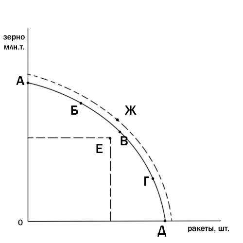
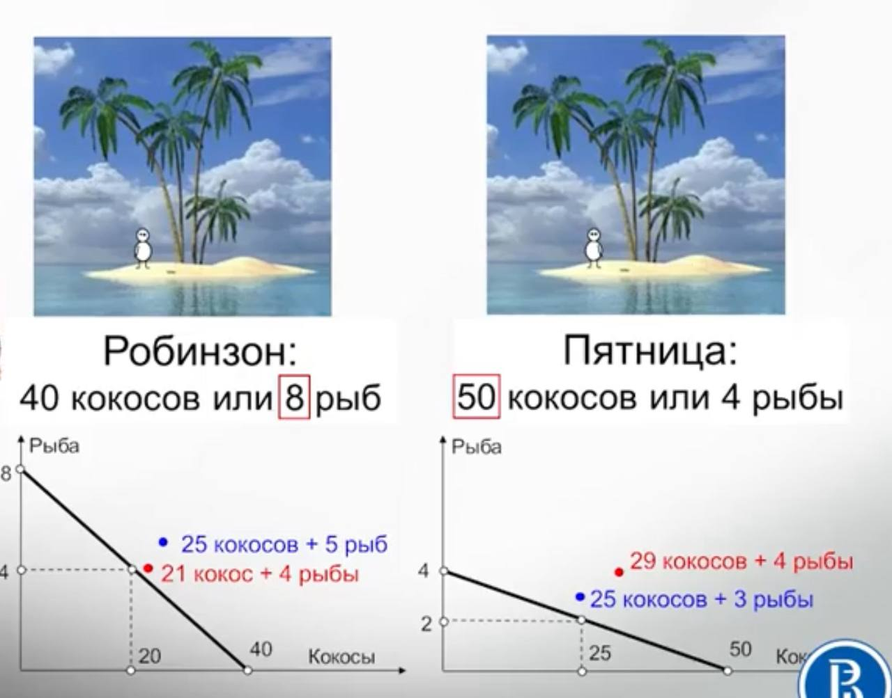
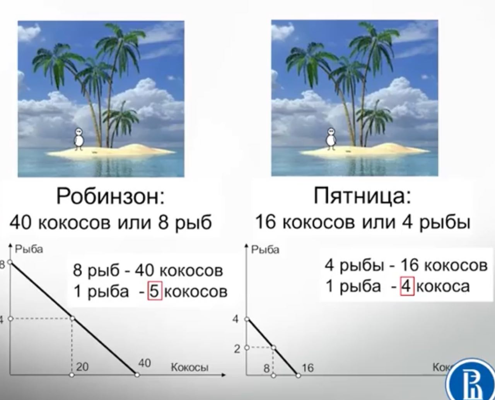

# Кривая производственных возможностей

Полное и эффективное использование ресурсов и несколько товаров. Тогда это - график всех возможных комбинаций нескольких продуктов которые можно произвести

Под кпв - "в час по чайной ложке; спустя рукава"

Над кпв - недостижимо

Но, если посмотреть на кооперацию, когда есть 2 товара (A и B) и два производителя со своими КПВ оба могут подняться выше кпв.

## Аюсолютное преимущество
Когда один из производителей, одно из благ способен производить больше остальных.

Но даже когда нет абсолютного преимущества, все равно можно извлеч выгоду - но нужно теперь считать соотношение: насколько дороже один товар относительно другого товара у разных участников - то есть надо смотреть у кого меньше **альтернативные издержки**

