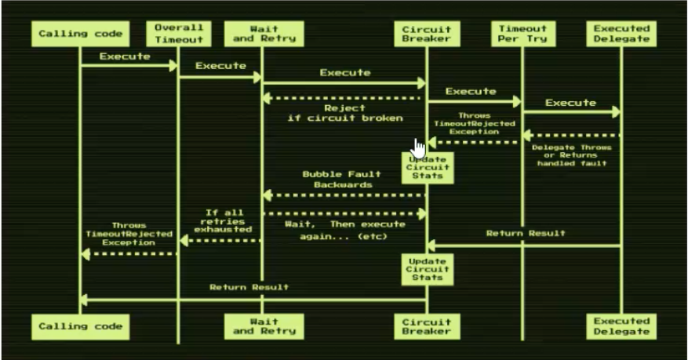

# Межсервисное взаимодействие

## Синхронное
- **Деградация**: сервис A ждет ответ от B, B работает медленно => A тоже работает медленнее - это назвается **деградацией**.
- **Идемпотентность** - операция, которая при повторном вызове дает тот же результат.
- **Ретраи**
- **Гарантии доставки**
- Rate Limit - чтобы сервис не ломился от количества запросов. Может быть
    - на балансировщике
    - внутри самого сервиса (в общем, не лучшая идея)
- Timeout - необходим при взаимодействии сервисов

Пайплайн для Polly:

(Без overall timeout - это классическая реализация)

## Асинхронное
- kafka (rabbitmq)
- outbox

outbox: в одной транзации и сообщение и запись в БД. 
