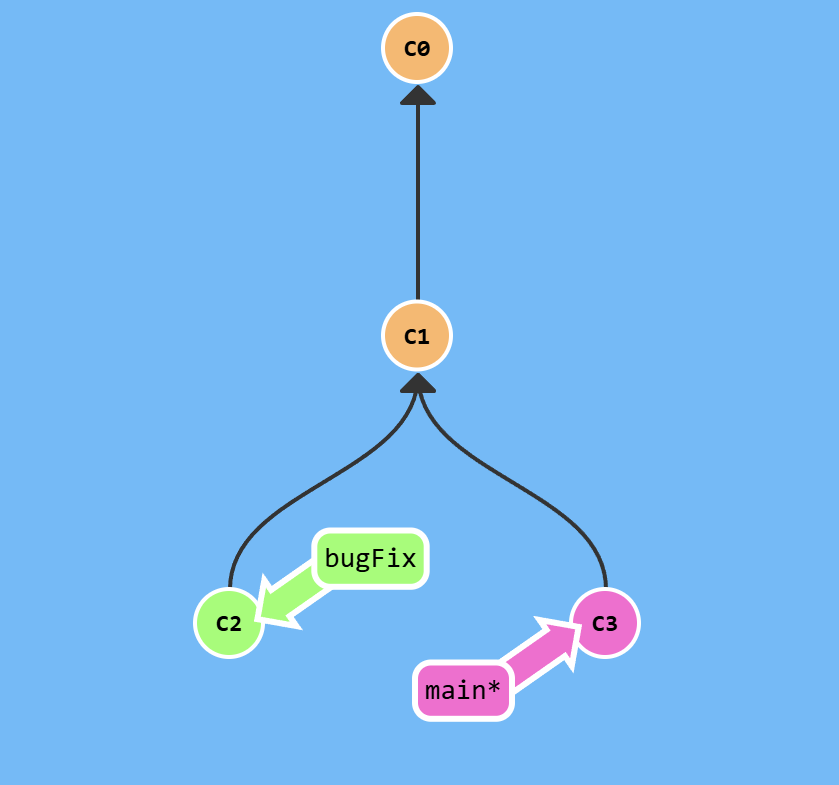
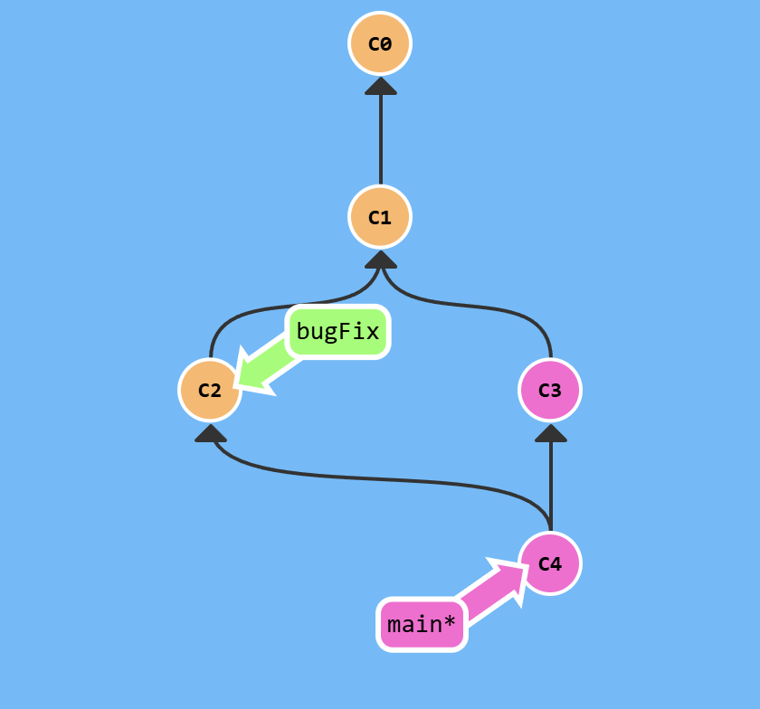
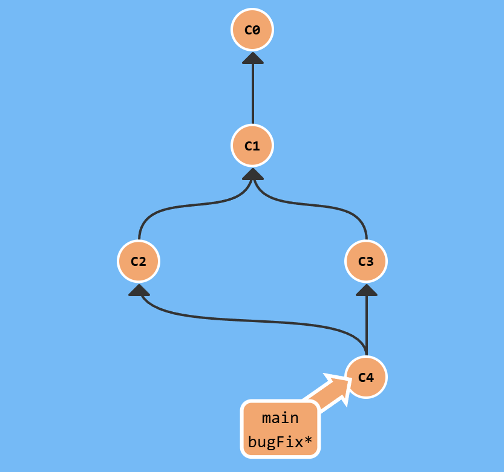
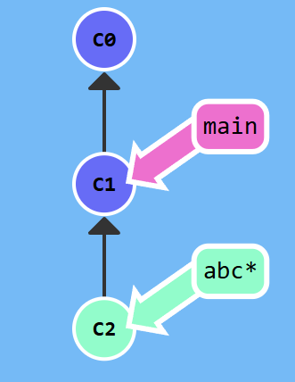
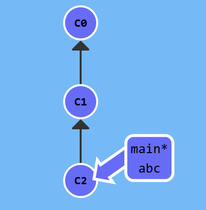
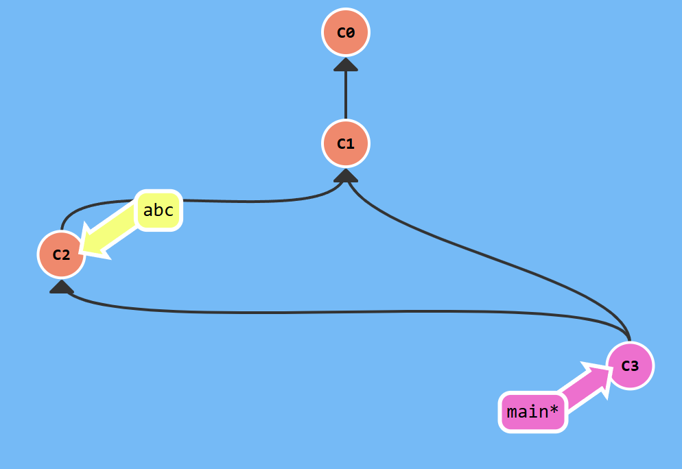

# merge
Основной спобсоб заливания работы. Эта комманда создает особый коммит, у которого 2 уникальных родителя.

**Как это выглядит:**


Мы находимся на ветке main. После комманды:
```sh
git merge bugFix
```
**Получается:**


То есть сливает ветки тот, кто хочет забрать изменения, а не тот кто хочет их даровать.

Затем, чтобы завершить слияние, следует написать:
```sh
git checkout bugFix
git merge main
```
**Получится:**


В целом, можно было продолжить работать в ветке `bugFix`. И мерджить еще много раз.

## Fasf forward, флаг --no-ff
Если на ветке `main` не было комитов после разделения на ветки, то `merge` мог бы просто переместить `main` вперед. 

Иными словами, странно, если один родитель предок другого родителя.

Можно принудительно отключить fast forward, написав
```sh
git merge --no-ff bugFix
```

До fast forward:


После простого merge (в main):


После merge --no-ff:


Вот так можно запретить fast forward:
```sh
git config --global merge.ff false
```

