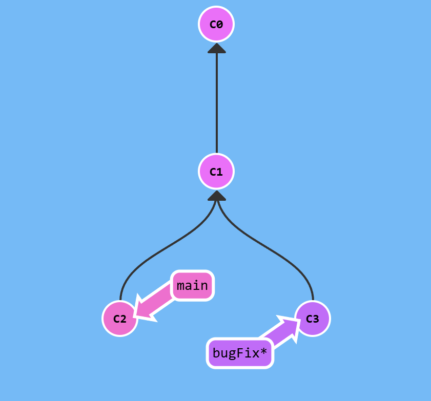
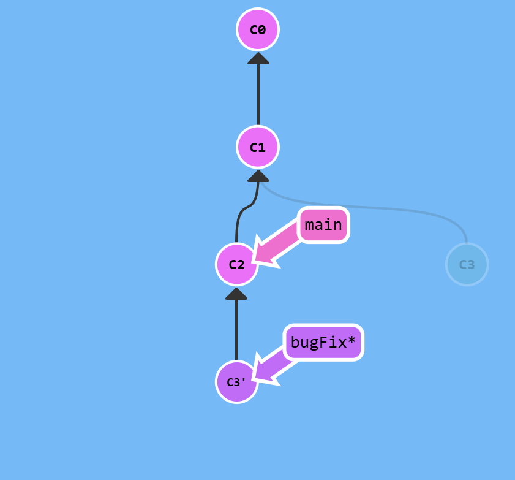
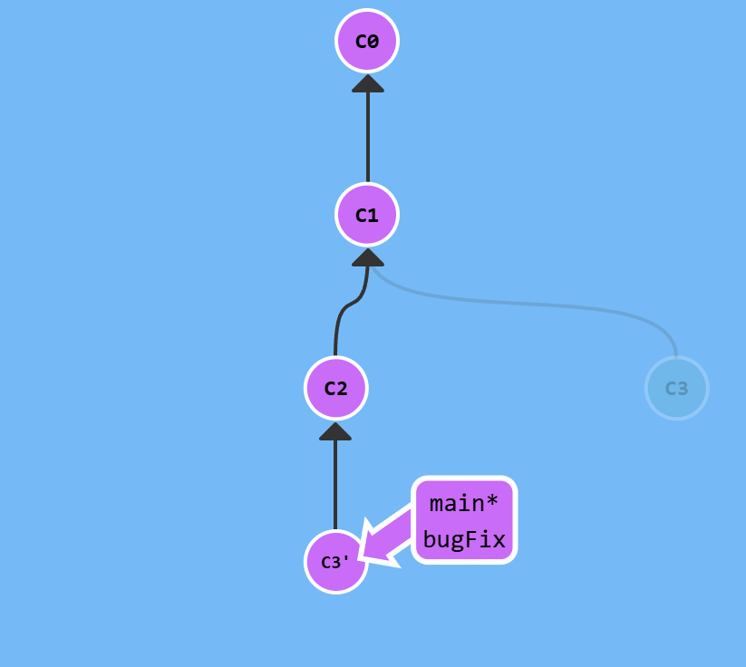

# rebase
Второй способ заливать изменения. В некотором смысле "более красивый". Вместо создания узла с двумя родителями, перемещает всю ветку изменений на место другой ветки. То есть история коммитов начинает казаться линейной, хотя и не является такой на самом деле.

Мы находимся на ветке `bugFix`. 

Чтобы перебазироваться на `main`, нужно написать
```sh
git rebase main
```
Получится:


Чтобы завершить перебазирование, нужно:
```sh
git checkout main
git rebase bugFix
```
В данном случае перебазирования не будет, просто переместится указатель.

Полученный результат:



