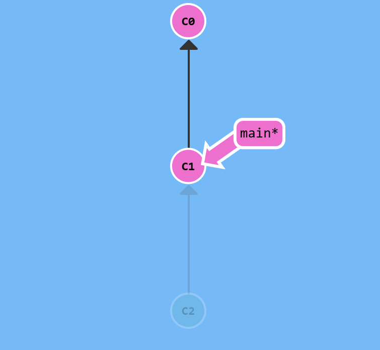

# Отмена изменений в Git

Есть 2 основных способа: reset и revert.
## reset
```sh
git reset HEAD^
```
Перемещает и ветку и `HEAD` назад (насколько указано), как будто текущего коммита никогда и не было:

||>>||
|-|-|-|

Есть 3 опции для reset:
1) *soft*: `git reset --soft HEAD^` - переместит, но изменения в случае чего можно будет достать из *индекса*
2) *mixed*: `git reset HEAD^` - отменяет комит и незакомиченные изменения, изменения тем не менее останутся в рабочей директории.
3) *hard*: `git reset --hard HEAD^` - исчезнут и изменения и коммиты до указанного (опасно)

## revert
```sh
git revert HEAD
```
Создает коммит противоположный текущему (с отменой изменений до родителя). На картинке как бы C2'=C1.

||>>||
|-|-|-|

Если после комманды выше возник конфликт, то его нужно руками разрешить и

```sh
git add .
git revert --continue 
```

Отмена revert:
```sh
git revert --abort 
```

## Как выбрать
`revert` - предпочтительный способ откатывать изменения на remote ветках, так как новый коммит можно запушить, а откат до старого - неудобен.

`reset` хорош и удобен для локальных веток.
