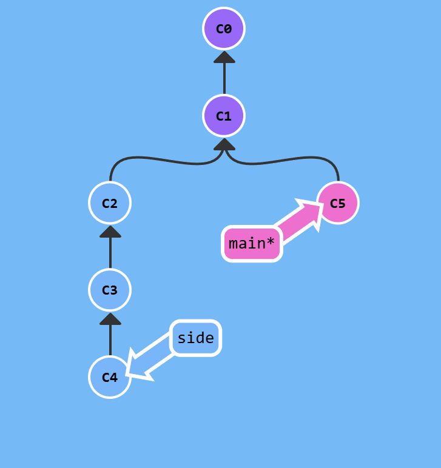
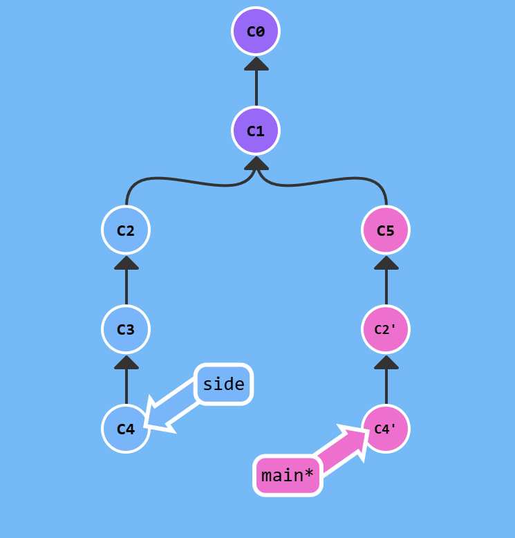

# Дополнительно

## cherry-pick
Не очень понятно, что эта комманда делает внутри гита, но с точки зрения дерева все очень просто: перемещает указанне коммиты в указанном порядке в место, где вы находитесь так, будто вы сами сделали это коммиты:
```sh
git cherry-pick commit1 [commit2 ...]
```



После команды
```sh
git cherry-pick C2 C4
```



## rebase
Более удобная, урезанная версия cherry-pick.
```sh
git rebase -i HEAD~4
```
это откроет интерактивный редактор выбора коммитов, которые надо выбрать чтобы они торчали из места, на которое указывает `HEAD~4`.
