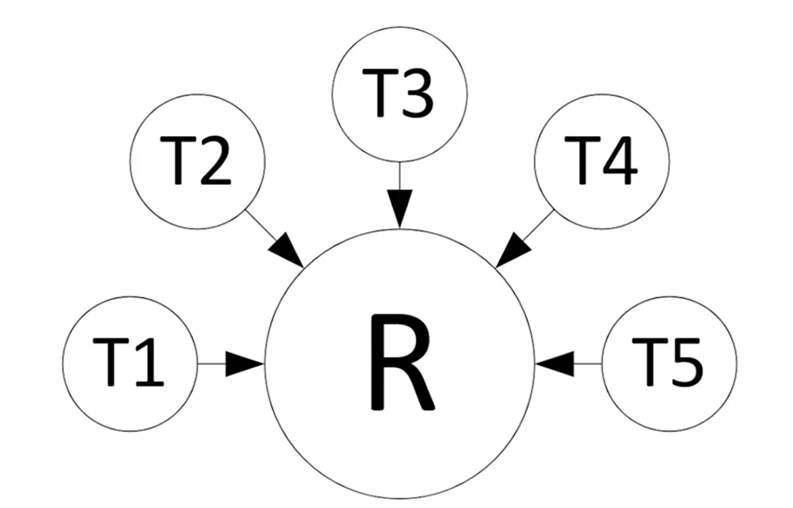
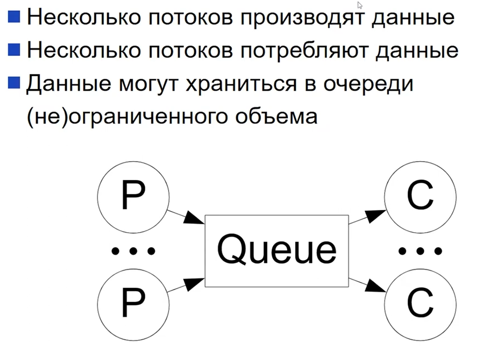
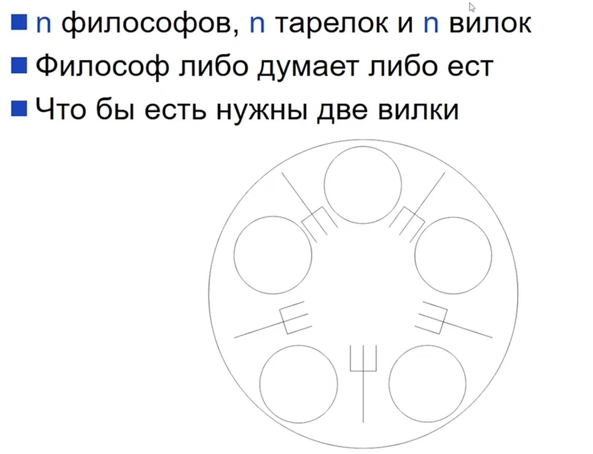
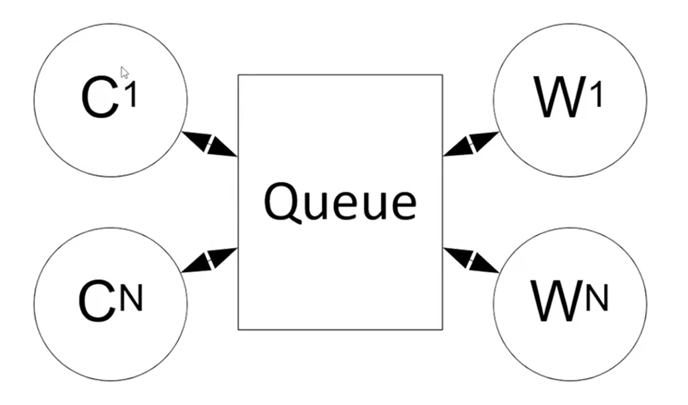

# Класические задачи многопоточного прогргаммирования

## Задача доступа к общему ресурсу
Несколько потоков обращаются к общему ресурсу. Считаем, что доступ к этому ресурсу допустим только из одного потока в данный момент времени.

Решение: синхронизация (atomic, synchronized(), synchronized collections)

## Производитель-потребитель

Проблемы:
* Возможна разная скорость производителей и потребителей. Если производители быстрые - возможно OutOfMemory, поэтому надо ограничивать очередь. Если потребители быстрые - они будут простаивать.
* Читать можно без синхронизации, писать - нельзя.

## Задача об обедающих философах

Если каждый философ сначала берет правую вилку, то возможен deadlock.

Решение: один философ сначала берет левую вилку, потом правую. Остальные сначала берут правую.

Другая нотация: вилки занумеровали 1..n. Тогда каждый философ берет сначала вилку с меньшим номером, потом с большим.

## Задания и работники
Поток-клиент ждет выполнения потока-работника (потока-сервера)

Решение: задания, очередь, счетчики на пулл заданий.
