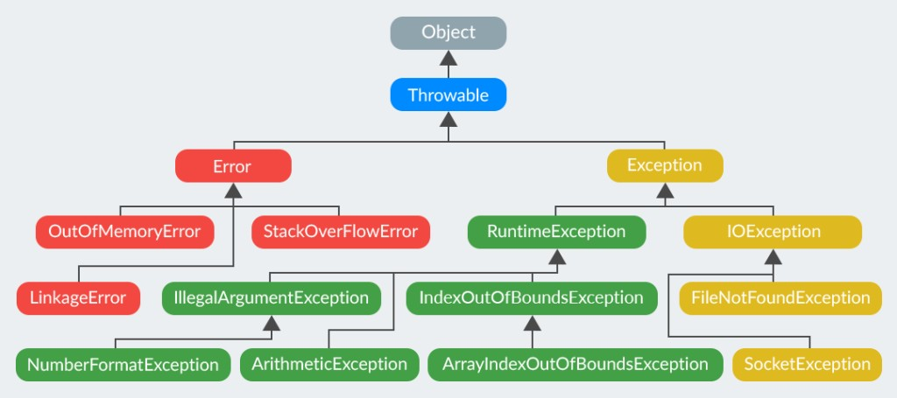

# Нюансы языка программирования Java
## Исключения
* *Проверяемые* - все, которые наследуются от `Exception`, кроме `RuntimeException`.
* *Непроверяемые* - остальные, в том числе которые наследуются от `RuntimeException`.
* *`Error`* - ошибки, ими называются серьезные системные ошибки вроде `OutOfMemoryError`, `StackOverflowError`.



## foreach
Итерирование работает только с массивами `T[]` и объектами, реализующими `Iterable<T>`.

Нельзя изменять коллекцию при итерировании, иначе возникнет `ConcurrentModificationException`.

Если нужен доступ к индексу - нужен обычный `for`.

## Массивы
**Примеры:**
```java 
int[] nums1 = {1, 2, 3, 4, 5};
int[] nums2 = new int[]{1, 2, 3};
String[] names = new String[3];

int[][] c1 = new int[][] {{1, 2}, {3, 4}};
int[][] c2 = new int[][] {{1, 2}, {3}, {4, 5, 6}};
int[][] c3 = new int[3][];
int[][] c4 = new int[3][4];
int[][] с5 = new int[][] {
  new int[] {10, 20},
  new int[] {70, 80, 100},
  new int[] {110}
};
```

Двуменрые массивы бывают *прямоугольные* и *рваными (jagged array)*.

`int[]` - тоже наследуется от `Object`.

*Копирование:*
```java
int[] copy = Arrays.copyOf(arr, arr.length);
int[][] matrixCopy = Arrays.stream(matrix).map(int[]::clone).toArray(int[][]::new);
```

*Сравнение:*
```java
Arrays.equals(a, b); // поверхностное
Arrays.deepEquals(matA, matB); // для 2+ размерностей
```

```java
List<Integer> list1 = Arrays.asList(objectArray);  // OK
List<Integer> list2 = Arrays.asList(primitiveArray);  // Error
```

## Обертки
```java
Integer i = 10;  // Автоупаковка (int → Integer)
int j = i;       // Автораспаковка (Integer → int)
Integer.valueOf(127) == Integer.valueOf(127) // cache -128..127
```

## Строки
```java
String a = "abc"; // string pool
// like in C++ .data section
String b = "abc";
a == b; // true, point to the same string
```

## == 
Сравнение ссылок, для примитивов - значения.

`obj1.equals(obj2)` - понятно. Плохо работает с наследованием (тяжело реализовывать).

## final
* *Поле:* нельзя изменить.
* *Метод:* нельзя переопределить.
* *Класс:* нельзя наследовать

## volatile
**Дает 2 гарантии:**
1) Остальные потоки сразу увидят изменения (в обход кэша)
2) Процессор и компилятор не будут переставлять операции чтения и записи.
3) Этого нихрена не достаточно для понимания

