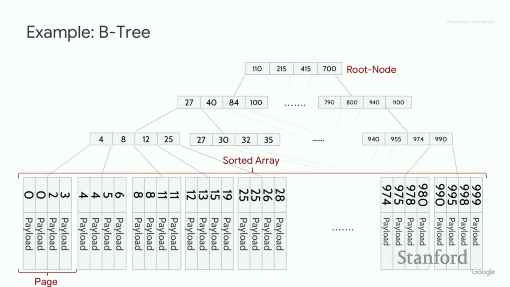

# Обученные индексы

- В БД - дефольный индекс - это B-Tree.
- **нейронная сеть:** линейная моель нерона МакКаллока-Питтса: Линейные функции вида $ax+b$. Обученный нейрон - ... Нейросеть - много нейронов, много слоев, на нижнем слое - инпуты, на верхнем слое - один нейрон (например).
- **архитектура трансформер** - преобразование sequence -> sequence причем часи не зависят друг от друга.
- **обучение с учителем** - предсказание функции по точкам.
- **обучение с подкреплением** - среда выдает фидбек, модель учитывая фидбек что-то меняет в себе.
- Переобученная модель - полностью выучила данную функцию - это плохо, как и недоученная
- Фильтр Блума. Набор хэш функций ($f_i: obj \rightarrow 1..n$), маленький массив ($n$) и при добавлении $arr[f(o)] = true$ для каждой хэш функции. Проверка что есть - проверить что $true$ везде где надо, есть $false$ - точно нет, иначе - возможно есть.

## B-Tree

**Чем круто:**
- Ниже двоичного дерева
- Глубина 5 => несолько десятков ГБ данных
- Слой ложится в кэш-линию (64-128 байт)
- Выгодно считывать данные с жесткого диска, потому что блочно все
- Идея SIMD - Single Instruction Multiple Data. Процессоры часто делают одну инструкцию 

Пример: ключи - все числа от 1 до n. Тогда b-дерево - сд, которая по ключу показывает позицию.

Идея: b-дерево мапит ключ в страницу

Модель: $f(key) = pos$, но настоящее значение позиции находится где-то в $[pos-err_{min}, pos+err_{max}]$

От $b$ до $2b$ детей. Исключение - корень.

