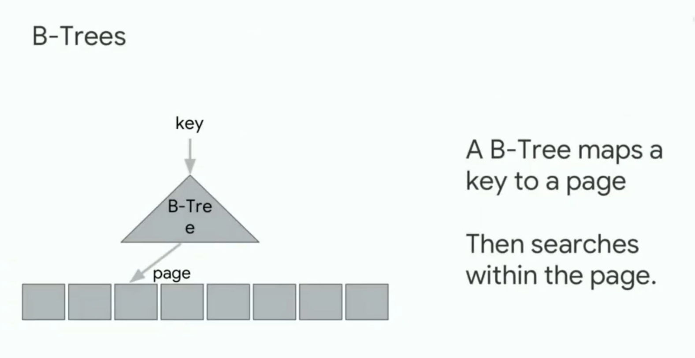

# B-Tree

Общее
-



**Чем круто:**
- Ниже двоичного дерева
- Глубина 5 => несолько десятков ГБ данных
- Слой ложится в кэш-линию (64-128 байт)
- Выгодно считывать данные с жесткого диска, потому что блочно все
- Идея SIMD - Single Instruction Multiple Data. Процессоры часто делают одну инструкцию 

Пример: ключи - все числа от 1 до n. Тогда b-дерево - сд, которая по ключу показывает позицию.

Идея: b-дерево мапит ключ в страницу


Модель: $f(key) = pos$, но настоящее значение позиции находится где-то в $[pos-err_{min}, pos+err_{max}]$

От $b$ до $2b$ детей. Исключение - корень.

Структура
-

- Во всех узлах кроме корня $[t-1 \dots 2t-1]$ ключей
- Во всех внутренних узлах кроме корня $[t\dots2t]$ дочерних узлов
- Корень содержит $[1\dots 2t-1]$ ключей и $[2\dots 2t]$ сыновей
- ключи упорядочены и в ребенке $i$ ключи из $[k_{i-1}\dots k_i]$ и подобное

```c++
class Node {
  bool    is_leaf;
  int[]   keys;
  Node*[] children;
}

class BTree {
   int   t; // const
   Node* root;
}
```


