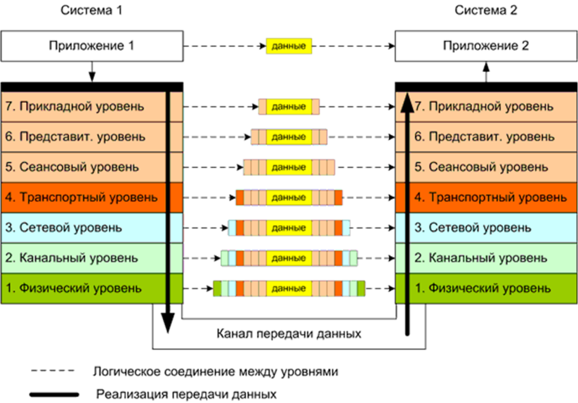

# Компьютерные сети

## Общее
__Модели:__
* _OSI_
* _TCP/IP_

__Прикладные протоколы:__
* _HTTP_, _DNS_
* _HTTP/2_, _HTTP/3_

__Транспортный уровень:__
* _TCP_, _UDP_
* _QUIC_
* Сокеты

__Сетевой уровень:__
* Протокол _IP_
* маршрутизация

__Канальный уровень:__
* _WiFi_
* _Ethernet_

__Физический уровень__

## Проблемы
1) __Надежность__. При передаче данных бывают ошибки: искажение данных, потеря сообщения, неправильный порядок получения сообщений. Также соединение через посредников может прерваться.
2) __Развитие сети__. Увеличение числа устройств не должно влиять на качество и скорость работы сети. Также бывает, что у разных сетей разные протоколы.
3) __Распределение ресурсов__. Распределение пропускной способности бывает статическое (скорость фиксирована) и динамическое (скорость определяется автоматически и меняется). Лучше динамическое. Управление потоками: _затопление_ - у отправителя большая скорость, получатель медленный - потеря дынных. _скопление_ - перегрузка сети большим количеством исформации.
4) __Качество обслуживания__. Видео, голос и пр: быстро и не обязательно сверхкачественно. Файлы: скорость не страшна, гглавное чтобы все данные корректно дошли.
5) __Безопасность__. Фальшивый сайт банка, злой посредник, меняющий сообщение, и пр.
6) __Энергетическая эффективность__. Понятно. 

## Абстрактное устройство сети
Данные передаются по __уровням__. В классической модели уровней 4.

(отправитель) 4 -> 3 -> 2 -> 1 -> среда передачи данных -> 1 -> 2 -> 3 -> 4 (получатель).

То есть производится __декомпозиция__: каждый уровень работает независимо и каждый можно менять отдельно.

Например, чтобы переключиться из беспроводного соединения на проводное, нужно отредактировать только один уровень.

__Интерфейс__ - набор операций, который предоставляется уровнем ниже уровню выше. То есть обеспечивает взаимодействие между уровнями.

__Протокол__ - (виртуальное) взаимодействие между одним уровнем у разных устройств.

__Сервис__ - определяет, что делает уровень.

__Замечания__: 
* Такая терминология имитирует ООП.
* Внутри устройства: интерфейс постоянный, протокол может меняться. 
* Между устройствами протокол постоянный, а интерфейс может меняться. 

__Архитектура сети__ - набор уровней и протоколов. Интерфейсы - не часть архитектуры.

__Стек протоколов__ - иерархически организованный набор протоколов для организации взаимодействия сети.

__Инкапсуляция__ - включение сообщение уровня выше с сообщение уровня ниже. Как это примерно выглядит:
```
n+2)         [d]
n+1)     [h1][d]
  n) [h2][h1][d][t2]
```
__Заголовок (header)__, __данные (d)__ и __концевик (footer/trailer)__.

Концевик чаще нужен на нижних уровнях.

Получатель ракручивает заголовки и концевики.

