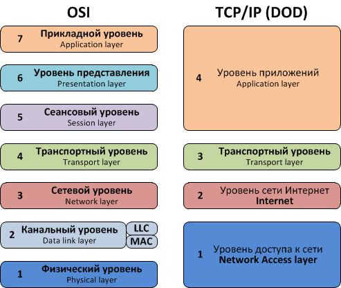
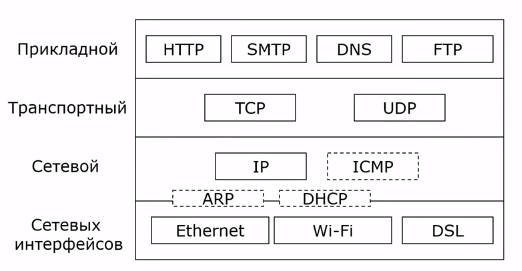

# Эталонные модели сети

... - описание сервисов и уровней сети.

__Популярные модели:__
* Модель взаимодействия открытых систем (_ISO OSI_)
* Модель _TCP/IP_

## OSI

* Принята в 1983 международной организацией по стандартизации
* _Open Systems Interconnection Reference Model_
* Открытая система - построенная в соответствии с открытыми спецификациями.
* 7 уровней

__Уровни:__

* Прикладной (Application)
* Представления (Presentation)
* Сеансовый (Session)
* Транспортный (Transport)
* Сетевой (Network)
* Канальный (Data link)
* Физический (Physical)
* _среда передачи данных_

### Физический уровень
... - передача потоков бит с заданой скоростью.

### Канальный
... - сетевое взаимодействие: логическое соединение, согласование скорости передачи и приема, обнаружение и исправление ошибок

В широковещательной сети (например, _wifi_) также управляет доступом к среде передачи данных.

Обеспечивает также физическую адресацию

### Сетевой уровень
Объединаяет несколько сегментов сети в конгломерат.

Задачи:
* Адресация - сетевыые либо глобальные адреса
* Определение маршрутов отправки пакетов
* Согласование характеристик сетей

### Транспортный уровень
Обеспечивают передачу данных с должным уровнем надежности.

В OSI есть 5 классов транспортного сервиса (0-4). Обычно используется _защищенный от ошибок с гарантированным порядком следования сообщений_.

Это первый сквозной уровень (между отправителем и получателем), также первый сетенезависимый.

### Сеансовый
... - создает сеансы связи.

Задачи:
* Управляет диалогом, очередностью сообщений
* Синхронизация
* Возобновление сбоев

### Представления
... - согласование синтаксиса и семантики:

* _little-endian_ vs _big-endian_
* Формат представления чисел
* Формат представления символов
* Шифорвание и дешифрование (TLC - transport layout security)

### Прикладной
... - приложения.

_OSI_ не используется на практике. Она идейная (набор терминов).

## TCP/IP
* Стек протоколов _TCP/IP_
* ARPANET - компьютерная сеть, созданная в 1969 году в Управлении перспективных исследовательских проектов Министерства обороны США.
* Названа в честь 2 самых популярных протоколов
* 4 уровня (ближе к практике)
* Не углубляется во взаимодействие в сети

__Уровни:__
| TCP/IP | OSI |
|-|-|
| Прикладной (Application) | A+P+S |
| Транспортный (Transport) | T |
| Интернет (Internet) | N |
| Сетевых интерфейсов (Network access) | DL + P |

_subnet_ - подсеть

_internet_ - объединённая сеть (не путать с __Internet__)

_internetworking_ - объединение сетей

### Стек протоколов TCP/IP

* __прикладной__: _HTTP_, _DNS_, _SMTP_
* __транспортный__: _TCP_, _UDP_
* __интернет__: _IP_, _ICMP_
* __сетевых интерфейсов__: _Wifi_, _Ethernet_

