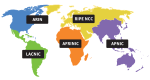

# Эталонная модель TCP/IP

## 1. Уровень сетевых интерфейсов
- не очень волнует как данные передаются.

* _WiFi_. Точка доступа - к ней подключаются устройства
* _Ethernet_. Устройства подключаются к коммутатору по проводу.

### Физическая адресация
__MAC (Media Access Control)__ - адреса используемые для идентификации узлов в сети WiFi и Ethernet. (см. стандарт IEEE 802)

_MAC_-адреса:
* Должны быть уникальными в пределах одной сети (_LAN_) (например, в квартире)
* 6 байт (48 бит)
* Шесть шестнадцатеричных цифр:
  * `1C-75-08-D2-49-59` (формат IEEE)
  * `1C:75:08:D2:49:59` (формат EITF)
* Особенности:
  * Каждый сетевой адаптер WiFi и Ethernet имеет уникальный встроенный производителем _MAC_-адрес.

## 2. Уровень интернета
... - объединение сетей с разными сетевыми технологиями.

__Маршрутизатор__ - устройство для объединения сетей в одну.

Задача - поиск маршрута из одной сети в другую через граф из маршрутизаторов.

На уровне интернета используется глобальная адресация.
* Она не привязана к сетевым технологиям
* Уникальная идентификация компьютера в составной сети

_IP_-адрес:
* _internet protocol_
* Протокол межсетевого взаимодействия
* Формат записи: 4 числа 0-255: `192.168.1.1`
* Должны быть уникальными __во всем мире__. Этим занимается _Internet Assigned Numbers Authority_ (_**IANA**_) через региональных регистраторов (в России \<райп\>):

## 3. Транспортный уровень
Пример: пользователь открыл 2 браузера и сделал одинаковый запрос, надо разобраться, какому браузеру отправить ответ.

Транспортный уровень отвечает за связи между отдельными прочессами.

На транспортном уровне используются __порты__: 
* Числа от 1 до 65535
* Что-то вроде адреса процесса
* У каждого сетевого приложения должен быть один уникальный в масштабах устройства порт.
* Формат записи: _IP_:_port_, например, `192.168.1.100:80`

## 4. Прикладной уровень

Протоколы прикладного уровня:
* _HTTP_ - Hypertext Transfer Protocol (передача гипертекста)
* _HTTPS_ - Hypertext Transfer Protocol Secure
* _DNS_ - Domain Name System (система доменных имен - определение IP адреса по __доменному имени__)
* _SMTP_ - Simple Mail Transfer Protocol. Для электронной почты.

## Сводка

Стетвые приложения

__Хост__ - то, где работают сетевые приложения.

_UDP_ - User Datagram Protocol. В UDP есть _broadcast_.

_TCP_ - Transmission Control Protocol. Надежное соединение с варификацией.

