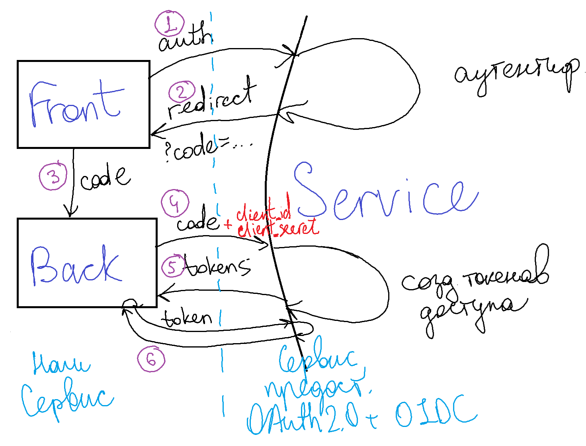

# OAuth2.0, OpenId Connect

Позволяет войти в сервис через другой сервис, в котором пользователь уже зарегистрирован

**Как это происходит:**
- Пользователь входит на ваш сайт
- Нажимает "войти через Service"
- Авторизуетcя на том Service
- Получает вход на нашем сайте

**2 сценария:**
1) Нужен только вход в ваше приложение
0) Нужны также доп данные пользователя от Service (файлы с гугл диска например)

## 1. Open ID Connect (OIDC)
- Надстройка над OAuth2.0
- Только аутентификация, то есть, только вход на ваше приложение и самые базовые данные о клиенте (почта и имя, например)

Нажатие кнопки войти через Service - гиперссылка вида
```bash
https://service.com/oauth/auth
  &client_id=...
  &scopes='openid profile email'
  &redirect_url='http://localhost:3000/login/by/service'
  &responce_type=code
```

Затем происходит редирект обратно на наш сайт с ?code=... 

Этот code затем необходимо будет передать Service чтобы получить все нужные права и прочее.

Важно, что это получение прав необходимо осуществлять с бекэнда.

То есть фронт отправляет code на бек, бек уже отправляет это в Service и тем самым получает доступ.



## 2. OAuth2.0
- Это протокол для доступа к данным пользователя, которые хранятся на Service.
- Позже уже сошлись на идее, что это можно использовать как просто аутентификацию

