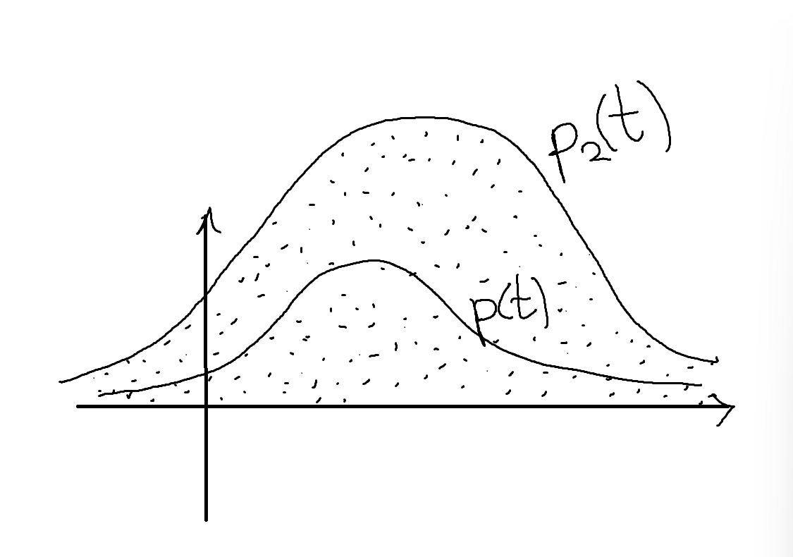
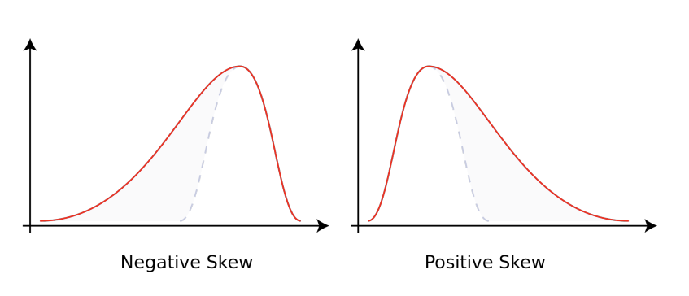
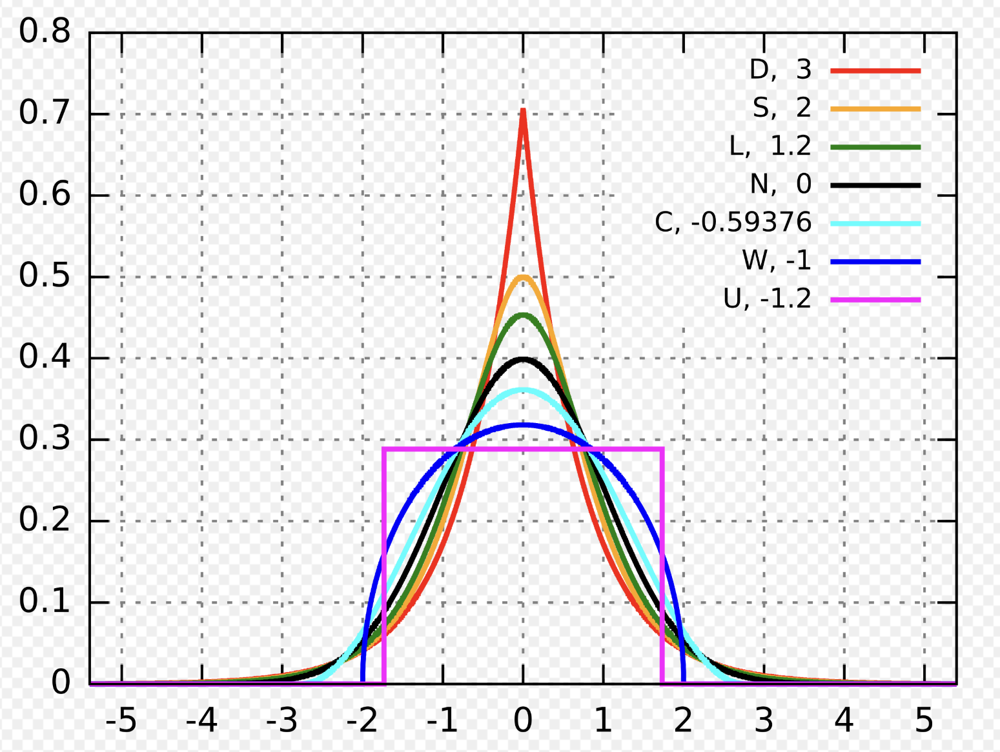

# Всякая база из теорвера

Случайная величина определение
-

$(\Omega, \mathcal{A})$ - сигма-алгебра событий, $X$ - измеримая функция из $(\Omega, \mathcal{A})$ в $(\mathbb{R}, \mathcal{B})$, где $\mathcal{B}$ - борелевская сигма-алгебра. То есть $\forall B \in \mathcal{B}\ X^{-1}(B) \in\mathcal{A}$. Тогда $X$ - случайная величина.

Свойства CDF
-
$F(t) = P(X \leqslant t)$

1) $F(-\infty) = 0$
2) $F(+\infty) = 1$
3) $F(x + 0) = F(x)$
4) $F \nearrow$
5) (теорема) $\forall F$, удовл. условиям 1-4, $\exist X$ - случайная величина.

Типы случайных величин
-

### Дискретные
||||
|-|-|-|
|$\text{Bern}(p)$|$P(X = 1) = p$, $P(X = 0) = q = 1 - p$|-|
|$\text{Bin}(n,p)$|$P(X=k)=C_n^kp^kq^{n-k}$|n испытаний, P - шанс, что из них удастся k|
|$\text{NB}(r, p), r > 0,\ p \in (0, 1)$|$P(X=k) = \frac{\Gamma(k+r)}{k!\Gamma(r)}p^rq^k$|n испытаний, $X =\text{номер испытания, на котором случился r-й успех}-r$|
|$\text{Geom}(p)$|$P(X=k) = p^kq,k\geqslant0$ или $P(X=k) = p^{k-1}q,k\gt0$|P - шанс, что именно на k шагу случится первое успешное/последнее неуспешное испытание. В первом случае $\text{Geom}(p)=\text{NP}(1, p)$|
|$\text{Pois}(\lambda)$|$P(X=k)=e^{-\lambda}\frac{\lambda^k}{k!}, k \geqslant 0$|...|
|$\text{HG}(M,N,K)$|$P(X=t) = \frac{C_N^tC_{M-N}^{K-t}}{C_M^K}$|M - всего деталей, N хороших, K вытаскиваем. P - шанс что t хороших досталось|


### Непрерывные
|||
|-|-|
|$\text{U}\left[0,1\right]$|$p(t) = \frac{1}{b-a}1(t\in\left[0,1\right])$|
|$\mathcal{N}(\mu,\sigma^2)$|$p(t)=\frac{1}{\sqrt{2\pi\sigma^2}}\exp(-\frac{(t-\mu)^2}{2\sigma^2})$|
|$\mathcal{N}(0,1)$|$p(t)=\frac{1}{\sqrt{2\pi}}\exp(-\frac{t^2}{2}), F = \Phi$|
|$\text{Cauchhy}(t_0, \gamma)$|$p(t) = \frac{1}{\pi\gamma}\cdot\frac{1}{1 + (\frac{t - t_0}{\gamma})}$|
|$\text{Exp}(\lambda)$|$p(t) = \lambda e^{-\lambda t}, t \geqslant 0$|
|$\Gamma(k, \lambda)$|$p(t) = \frac{\lambda^k t^{k-1}}{\Gamma(k)}e^{-\lambda t},  t\geqslant 0$|
Распределение Эралнга = гамма распределение, но $k \in \mathbb{N}$

Суммы независимых случайных величин
-

Интеграл Лебега-Стилтьеса:

$$\int\limits_\mathbb{R} f(x)dF(x) = \lim\limits_{max(x_{j+1}-x_j)\rightarrow 0}\sum\limits_j g(x_j^*)(F(x_{j + 1}) - F(x_j))$$

|Дискретный случай|Непрерывный|
|-|-|
|$P(t)=\sum\limits_{x+y=t}P(x)P(y)$|$p(t)=\iint\limits_{x+y=t}p(x)p(y)dxdy$|

В обоих случаях (по теореме Фубини из матанализа): 

$$F_{X+Y}(t)=\int\limits_{\mathbb{R}}dF_X(t - x)dF_Y(x)dx$$

Некоторые суммы:
1) $Pois(\lambda_1) + Pois(\lambda_2) = Pois(\lambda_1 + \lambda_2)$
2) $Bern(p) + Bern(p) + .. + Bern(p) = Bin(n, p)$
3) $Geom(p) + Geom(p) + .. + Geom(p) = NB(n, p)$
4) $\mathcal{N}(\mu_1, \sigma_1^2) + \mathcal{N}(\mu_2, \sigma_2^2) = \mathcal{N}(\mu_1 + \mu_2, \sigma_1^2 + \sigma_2^2)$
5) $Exp(\lambda) + Exp(\lambda) + .. + Exp(\lambda) = \Gamma(n, \lambda)$

Генерация случайных величин
-
$\text{gen}: ()\rightarrow \left[0,1\right]$ - генерация равномерно распределенной случайной величины.

**Первый способ**. 
Определим $\text{IF}$ - способ обращения $\text{F}$.

$$\text{IF}(p) = \inf\left\{t|\text{F}(t)\geqslant p\right\}$$


Тогда случайная величина $X \sim \text{F}$ может быть промоделирована как $\text{genX}() = \text{IF}(\text{gen}())$

**Второй способ**.


Случайную величину с плотностью $p_2(t)$ генерировать умеем (gen2()). Нужно c $p_1(t)$ (gen1()). 

Подберем $c$: $\forall t\ cp_2(t) > p_1(t)$. И будем генерировать примерно так:

```c
double gen1():
  double x, y;
  do {
    x = gen2()
    y = p2(x) * gen()
  } while (y > p1(x));
  return x
```

Дело в том, что равномерная распределенность в подграфике плотности (двумерной фигуре) равносильна распределеннойти абсциссы с данной плотностью.

Генерируемая пара (x,y):

```c
x = gen2()
y = p2(x) * gen()
```

Дает равномерное распределение в подграфике.

Соответственно абсцисса такой точки из второго подграфика будет иметь нужную плотность.

**Примеры**

1) $x,y = \text{gen}()$

    $X = \sqrt{2\left|\ln(x)\right|}\sin(2\pi y)$

    $Y = \sqrt{2\left|\ln(x)\right|}\cos(2\pi y)$

    Тогда $X,Y \sim \mathcal{N}(0, 1)$ и независимы, а вектор $(X, Y)$ - стандартный гауссовский.

2) $x = \text{gen}()$

    $X = -\frac{\ln(x)}{\lambda}$ или $-\frac{\ln(1-x)}{\lambda}$ $\sim Exp(\lambda)$

3) $\text{Geom}(p)$:
```c
res = 0
while (genBern(p) == 0):
  res++
```

4) $Bin(n, p)$:
```c
res = 0
repeat(n):
  res += genBern(p)
```

5) $Pois(\lambda)$:
```c
res = 0
while (res < lambda):
  res += genExp(1)
```

6) Аппроксимация $\mathcal{N}(0,1)$ по теореме Муавра-Лапласа:

    $X = \frac{\text{Bin}(n, p) - np}{\sqrt{npq}}$

Матожидание, дисперсия
-
**Свойства:**
1) $E(XY) = EX \cdot EY$
2) $Var(aX + b) = a^2VarX$
3) $Var(X \pm Y) = VarX + VarY$ для независ
4) $VarX = 0 \Rightarrow P(X = c) = 1$
5) $VarX = \min E(X - a)^2$, причем $\argmin = EX$

**Неравенство Маркова**

$X > 0, \exist EX$, тогда $\forall c > 0$

$$P(x \geqslant c) \leqslant \frac{EX}{c}$$

**Неравенство Чебышёва**

$\exist EX, VarX$, тогда $\forall \epsilon > 0$

$$P(|X - EX| \geqslant \varepsilon) \leqslant \frac{VarX}{\varepsilon^2}$$

Следствие: положив $\varepsilon = k\sigma$:

$$P(|X - EX| \geqslant k\sigma) \leqslant \frac{1}{k^2}$$

на этом основано правило трех сигм.

Для некоторых величин:
|X|$EX$|$VarX$|
|-|-|-|
|$\text{Bern}(p)$|$p$|$pq$|
|$\text{Bin}(n,p)$|$np$|$npq$|
|$\text{Pois}(\lambda)$|$\lambda$|$\lambda$|
|$\text{Geom}(p)$|$\frac{q}{p}$|$\frac{q}{p^2}$|
|$\text{U}\left[a,b\right]$|$\frac{b-a}{2}$|$\frac{(b-a)^2}{12}$|
|$\text{Exp}(\lambda)$|$\frac{1}{\lambda}$|$\frac{1}{\lambda^2}$|
|$\Gamma(n, \lambda)$|$\frac{n}{\lambda}$|$\frac{n}{\lambda^2}$|


Слабый Закон Больших Чисел (ЗБЧ)
-

$X_i - \text{i.i.d},\ EX = \mu, VarX_1 = \delta^2$ (если есть), тогда

$$\lim\limits_{n\rightarrow\infty}P(\left|\overline{X} - \mu\right| \geqslant\varepsilon) \leqslant \frac{\delta^2}{n\varepsilon^2}$$

$$\lim\limits_{n\rightarrow\infty}P(\left|\overline{X} - \mu\right| \geqslant\varepsilon) = 0$$

Важно, что тут все заранее известно. $\mu$ - теоретическое.

Неравенства
-

**КБШ (1)**. $\text{Cov}(X,Y)$ - скалярное, значит

$$\text{Cov}^2(X,Y)\leqslant \text{Var}X\cdot\text{Var}Y$$

**КБШ (2)**. $$[E(XY)]^2 \leqslant EX^2\cdot EY^2$$

**Йенсена**. $g$ выпукла вниз, тогда

$$g(EX) \leqslant Eg(X)$$

**Ляпунова**. $q > p > 0$, тогда

$$(E|X|^p)^\frac{1}{p} \leqslant (E|X|^q)^\frac{1}{q}$$

**Гельдера**, **Минковского** - не интересуют.

Ковариация и корреляция
-
**Ковариация**. $Cov(X,Y) = E(X-EX)(Y-EY) = E(XY)-EX\cdot EY$

Свойства:
1) Что и у скалярного произведения
2) $Cov(X, c) = 0$
3) $X,Y$ - нез. $\Rightarrow Cov(X, Y) = 0$

**Коэфицент корреляции**. 

$\rho(X,Y) = \frac{Cov(X, Y)}{\sqrt{VarX\cdot VarY}} \in \left[-1,1\right]$
* $\rho = 1 \Rightarrow X = aY + b,\ a \geqslant 0$
* $\rho = -1 \Rightarrow X = -aY + b,\ a \geqslant 0$
* $\rho(X,Y) = Cov(\widetilde{X}, \widetilde{Y})$, где $\widetilde{X}, \widetilde{Y}$ - нормированные версии: $\widetilde{X} = \frac{X - EX}{\sqrt{VarX}}$ с $E\widetilde{X} = 0$, $Var\widetilde{X} = 1$.

Независимые случайные величины
-

**Независимые события**. $P(A\cap B) = P(A)P(B)$.

**Независимые случайные величины**.
$\forall \mathcal{B}_{1..n}\ P(X_1\in\mathcal{B}_1, .., X_n\in\mathcal{B}_n) = P(X_1\in\mathcal{B}_1)P(X_2\in\mathcal{B}_2)\cdots P(X_n\in\mathcal{B}_n)$

Важно понимать, что независимость случайных величин не зависит от их функций распределения, а зависит только от того, сказано ли, что они независимы, в отличие от независимых событий, независимость которых - факт, который можно проверить формульно.

Числовые характеристики распределения
-

* Начальный момент $k$-го порядка
* Абсолютный начальным момент $k$-го порядка
* Центральный момент $k$-го порядка
* Центральный абсолютным момент $k$-го порядка

**Коэффицент ассиметрии**. $\frac{E(X - EX)^3}{\sigma^3}$



**Коэффицент эксцесса**. $\frac{E(X - EX)^4}{\sigma^4} - 3$ (чтобы у $\mathcal{N}(0, 1)$ было 0)



**Квантиль** $q_\alpha$:

* $P(X\geqslant q_\alpha) \geqslant 1-\alpha$
* $P(X\leqslant q_\alpha) \geqslant \alpha$

$\text{med} X = q_{\frac{1}{2}} = \argmin \text{E}|X − a|$

В случае $\text{E}X$ и $\text{Var}X$ был $\argmin \text{E}(X-a)^2$

**Мода**. 
* $x_* = \argmax P(X = x)$
* $x_* = \argmax p(x)$

Полиномиальное распределение
-

$\text{Poly}(n, m, k)$ (хотя $m$ - количество исходо - обычно не указывается).

$$P(S_1=n_1,..,S_m=n_m) = C_n^{n_1,..,n_m}p_1^{n_1}\cdots p_m^{n_m}$$

$S_k$ - количество исходов $k$-го типа за $n$ испытаний. $C_n^{n_1,..,n_m} = \frac{n!}{n_1!n_2!\cdots n_m!}$ - полиномиальный коэфицент.

Многомерное
-

$\vec{X} = (X_1, .., X_n)$

$\text{E}\vec{X} = (\text{E}X_1, .., \text{E}X_n)$

$\text{Var}\vec X = \text{E}(\vec X - \text{E}\vec X)(\vec X - \text{E}\vec X)^T = \left\{\text{Cov}(X_i, X_j)\right\}_{i,j}$

$\text{Cov}(\vec X, \vec Y) = \text{E}(\vec X - \text{E}\vec X)(\vec Y - \text{E}\vec Y)^T = \left\{\text{Cov}(X_i, Y_j)\right\}_{i,j}$

**Свойства**.
* $\text{E}(AX + BY + c) = A\text{E}X + B\text{E}Y + c$
* $\text{Var}X \geqslant 0$ - неотрицательно отпределена:

    $A \geqslant 0 \Leftrightarrow$

    * $\forall \vec x \ \ \vec x^TA\vec x \in [0, +\infty)$
    * $A$ - матрица Грамма, т.е. $a_{ij} = \langle x_i,x_j\rangle$
    * Все собственные числа $\geqslant 0$, $A = U^*DU,\ U^*U=E,\ D = diag(\lambda_1, .., \lambda_n)$

* $\text{Var}AX = A\text{Var}XA^T$

**Полиномиальное**. $\vec X \sim \text{Poly}(n, p) \sim \sum\limits^n\text{Poly}(1, p)$

**Многомерное нормальное**. $\mathcal{N}(\vec 0, E)$.

$\vec X = (X_1, .., X_n)$, $X_i \sim \mathcal{N}(0,1)$.

$\vec X = \sqrt{\Sigma}\vec U+\vec\mu\sim\mathcal{N}(\vec\mu, \Sigma)$, где $\vec U\sim\mathcal{N}(\vec 0, E)$

$\sqrt{\Sigma} = \text{diag}(\sqrt\Sigma_{11},..,\sqrt\Sigma_{nn})$, в силу некоррелируемости, $\text{Cov}(X_i,X_j) = 0, i\neq j$.

Условные распределения
-

$P(X|Y_0) = \frac{P(X,Y_0)}{P(Y_0)}$

$p_{X|Y}(x|y_0) = \frac{p_{X,Y}(x,y_0)}{p_Y(y_0)}$

- Матожидание

    $E(X|Y = y_0) = \sum x_iP_{X|Y}(x_i|y_0)$ - функция от $y_0$. $E(X|Y = y) = f(y)$ - функция регрессии $X$ на $Y$.

- Дисперсия

    $\text{Var}(X|Y) = \text{E}((X-\text{E}(X|Y))^2|Y) = \text{E}(X^2|Y) - [\text{E}(X|Y)]^2$

**Свойства**
- $\text{E}(X|X = x_0) = x_0$
- $X$, $Y$ - нез $\Rightarrow E(X|Y) = EX = \text{const}(y)$
- $\text{E}X = \text{E}_{\text{by }Y}(\text{E}(X|Y)) = \text{E}f(y)$
- $\text{Var}Y = \text{E}[\text{Var}(Y|X)] + \text{VarE}(Y|X)$

Пределы
-

$(\Omega, \mathcal{F},\text{P})$. $X$ - случайная величина в этом пространстве $X(\omega)$. $\left\{X_k\right\}_{k=0}^{\infty}$ - последовательность случайных величин.

1) Сходимость почти наверное (a.s, almost surely). $X_n\stackrel{\text{a.s.}}{\longrightarrow} X$

    $P(\left\{\omega|X_n(\omega) \rightarrow X(\omega)\right\}) = 1$

    $P(\left\{\omega|X_n(\omega) \nrightarrow X(\omega)\right\}) = 0$

2) Сходимость по вероятности. $X_n\stackrel{\text{p}}{\longrightarrow} X$

    $\forall \varepsilon\gt 0\ P(\left|X_n-X\right|\geqslant \varepsilon) \rightarrow 0$

    $\forall \varepsilon\gt 0\ P(\left|X_n-X\right|\lt \varepsilon) \rightarrow 1$

3) Сходимость в среднем порядке $p$. $X_n\stackrel{\text{Lp}}{\longrightarrow} X$

    $E\left|X_n-X\right|^p \rightarrow 0$

4) Сходимость по распределению. $X_n \stackrel{\text{d}}{\rightarrow} X$

    $\forall x \text{ where } F - \text{continuous } F_n(x) \rightarrow F(x)$

    Важно понимать, что тут везде не сумма/разность двух случайных величин, а функция-сумма/разность от $\omega$.

    - Lp $\Rightarrow$ p
    - a.s. $\Rightarrow$ p
    - p $\Rightarrow$ d
    - $X_n\stackrel{\text{d}}{\rightarrow} C \Rightarrow X_n\stackrel{\text{p}}{\rightarrow} C$

5) $\mathcal{F}$ - множество CDF. Слабая сходимость $F_n \Rightarrow F$ если

    $\forall f \text{ - непр., огр. } \int\limits _{\mathbb{R}}f(x)dF_n(x) \rightarrow \int\limits _{\mathbb{R}}f(x)dF(x)$

Характеристические функции
-

**Одномерный случай**

$$f(t) = \text{E}\exp(itX) = \text{E}\cos(tX) + i\text{E}\sin(tX)$$

$$f(t) = \int\limits_\mathbb{R}\exp(itx)dF(x)$$

**Многомерный случай**

$$f(\vec t) = \text E e^{i\langle\vec t, \vec X\rangle}$$

$$f:\mathbb{R}^n\rightarrow\mathbb{C}$$

Свойства:
1) $f(0) = 1$
2) $|f(t)| \leqslant \text{E}|e^{itx}| = 1$
3) $Y=aX+b\Rightarrow f_Y(t)\equiv e^{itb}f_X(at)$

    - сдвиг $\Rightarrow$ поворот
    - масштаб $\Rightarrow$ увеличение частоты
4) $Y=-X\Rightarrow f_Y\equiv\overline{f_X}$
5) $X,Y$ - нез. $\Rightarrow f_{X+Y}\equiv f_Xf_Y$
6) $f(t)$ - равномерно непрерывна
7) $f'(0) = i\text{E}X$

Значения для распределений
|X|f_X|
|-|-|
|$P(X=c)=1$|$e^{itc}$|
|$\text{Bern}(p)$|$p + qe^{it}$|
|$\text{Bin}(n, p)$|$(p + qe^{it})^n$|
|$\text{Pois}(\lambda)$|$e^{\lambda (e^{it}-1)}$|
|$\text{U}[0,1]$|$\frac{e^{it} - 1}{it}$|
|$\text{U}[-1,1]$|$\frac{sin(t)}{t}$|
|$\mathcal{N}(0,1)$|$e^{-\frac{t^2}{2}}$|
|$\mathcal{N}(\mu,\sigma^2)$|$Y=\sigma X + \mu\ ...$|
|$\text{Exp}(\lambda)$|$\frac{-\lambda}{it - \lambda}$|
|$\Gamma(n, \lambda)$|$\left(\frac{-\lambda}{it - \lambda}\right)^n$|

**Формула обращения**

Какая-то сложная...

Остатки связанные с пределами
-

**Теорема Леви**. $X_n\stackrel{\text{d}}{\rightarrow}X \Leftrightarrow f_n\rightarrow f$

**Слабый ЗБЧ**. $\overline{X} \stackrel{P}{\rightarrow} \mu$

**ЦПТ**. $\frac{S_n-n\mu}{\sqrt{n\sigma^2}} = \sqrt n\frac{\overline X - \mu}{\sigma}\stackrel{\text d}{\rightarrow}\mathcal{N}(0,1)$