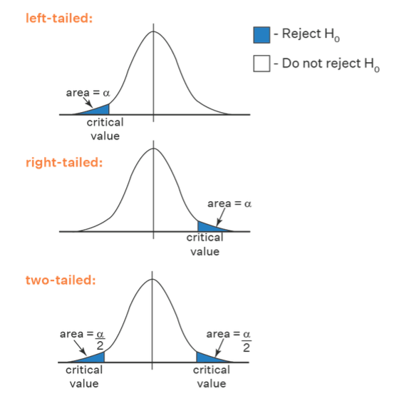

# Статистические тесты

Общая идея в сравнении гипотез, а не прямом доказательстве (которое невозможно).

1. Гипотезы
0. Статистический критерий, статистический тест - как он выглядит в общем виде
0. Статистика критерия - функция, в которую заложена проверка
0. Область принятия, критическая область
0. Основные примеры критических областей
0. p_value - удобное обобщение для уровня значимости
0. Ошибки статистических тестов

### Гипотезы
$H_0$ - **нулевая гипотеза** - предположение человека, находившегося в коме, до того, как ему задали соответствующий вопрос или инопланетянина (нет никакой связи, все хорошо и все здоровы)

$H_1$ - **альтернативная гипотеза** - предположение, которое хотим доказать.

### Статистический критерий, статистический тест

$\delta(\vec X, H_0, H_1, \alpha) = \left\{\begin{matrix}\text{accept } H_0\cr\text{reject }H_0\text{, more like }H_1\end{matrix}\right.$

$\vec X$ - выборка в самом широком смысле.

$\alpha$ - уровень значимости. Чем меньше, тем достовернее будет проверка, что $H_0$ неверна и скорее верна $H_1$. Обычно, $\alpha \in \left\{0.1, 0.05, 0.001\right\}$

### Статистика критерия

$T(\vec X) \cong U \sim G$

$T$ - функция от выборки, такая, что при условии $H_0$, случайная величина $T(\vec X)$ имеет распределение $G$ либо стремится к нему при $n \rightarrow \infty$.

### Область принятия, критическая область

Область принятия $T_0(\alpha)$ - область, при подании $T(\vec x)$ в которую, считаем, что верна $H_0$. Вероятость попасть туда $\approx 1-\alpha$.

Критическая область $T_1(\alpha)$ - область, при подании в которую, считаем, что $H_0$ неверна. Шанс в нее попасть должен быть $\approx \alpha$.

Тогда функция $\delta$ выглядит примерно так:

```d
δ(x, α):
  if T(x) in T(1, α):
    reject H0
  else:
    accept H0
```

### Основные примеры критических областей

1. $T_1(\alpha) = \left[q_{1-\alpha},+\infty\right)$ - правосторонняя, right-sided
0. $T_1(\alpha) = \left(-\infty, q_{\alpha}\right]$ - левосторонняя, left-sided
0. $T_0(\alpha) = \overline{T_1(\alpha)} = \left(q_{\frac{\alpha}{2}},q_{1-\frac{\alpha}{2}}\right)$ - двусторонняя, both-sided



### p_value

Если пользоваться просто критическими областями, то надо будет сообщать пользователю: тип области, значение квантиля, значение $T(\vec x)$ и результат сравнения.

Можно это обобщить, введя p_value = $p$. Оно обозначает **шанс, что значение $U$ экстримальнее, чем $T(x)$**:

$$p(\vec x)=P(U \text{ more in }T_1(\alpha)\text{ than }T(\vec x))$$

В случаях областей выше, это будет:
1. right-sided: $p_r = P(U>T(\vec x)|H_0)$
0. left-sided: $p_l = P(U<T(\vec x)|H_0)$
0. both-sided: $p_b = 2\min(p_l, p_r)$

Тогда достаточно будет сравнить $\alpha$ и $p$.
- $p<\alpha$ - reject $H_0$
- $p>\alpha$ - accept $H_0$

То есть проверку $T(\vec x) \in T_1(\alpha)$ можно теперь заменить на $p(\vec x) < \alpha$.

### Ошибки статистических тестов
|test\\real|$H_0$|$H_1$|
|-|-|-|
|$H_0$|true-positive|false-negative (II рода, $\beta$)|
|$H_1$|false-positive (I рода, $\alpha$)|true-positive|

Запомнить когда 1 а когда 2 рода можно так: $1=01_2$, $2=10_2$.

Ошибка false-negative ($\beta$) хуже, так как это может привести (например, пациента) к фатальным последствиям.

- $\alpha = P(\text{false-positive})$
- $\beta = P(\text{false-negative})$

**Состоятельность теста:** $\beta \rightarrow 0$ при $n \rightarrow \infty$.

В общем случае, $\alpha$ и $\beta$ зависят друг от друга, при том обратно (меньше $\alpha$ - больше $\beta$).

Статистические критерии
-

### Медиана и квантили
- $H_0: \text{med} X = c$
- $H_1: \text{med} X \neq c$

$\text{med}X = q_{\frac 1 2}$

Теорема из вариационных рядов:

$$\sqrt{n} p(q_a)\frac{X_{[an]} - q_a}{\sqrt{a(1-a)}}\rightarrow\mathcal{N}(0,1)$$

Тогда можно составить такую статистику критерия: 

полагая $H_0$,

$$T(X) = 2\sqrt{n}p(c_0)(X_{[\frac n 2]} - c_0)\rightarrow \mathcal{N}(0,1)$$

### Нормальное распределение

$X_1, ..., X_n \sim \mathcal{N}(\mu,\sigma^2)$, предполагается матожидание. $H_0: \mu = \mu_0$

1. $\sigma$ - известна. Тогда 
$$T(\vec X) = \sqrt{n}\frac{\overline X - \mu_0}{\sigma}\rightarrow \mathcal{N}(0,1)$$

2. $\sigma$ - неизвестна. Тогда 
$$T(\vec X) = \sqrt{n}\frac{\overline X - \mu_0}{S}\rightarrow T(n-1)$$

**Робастность** -  устойчивость статистики критерия к изменению априорного предположения. 

Здесь, если неверно $X \sim \mathcal{N}$, то это сильно влияет на $\sim T(n-1)$.

$X_1, ..., X_n \sim \mathcal{N}(\mu,\sigma^2)$, хочется узнать дисперсию

$H_0: \sigma = \sigma_0$

$$\frac{nS_*^2}{\sigma_0^2} \sim \chi^2(n-1)$$

Две выборки одинакого размера (парные)
-

### Равенство матожиданий 1
$X_1,..,X_n$ и $Y_1,..,Y_n$ независимы, $H_0: \mu_X = \mu_Y$

Тогда достаточно $U_i = X_i-Y_i$ и $H_0: \text{E}U = 0$

### Равенство дисперсий для $\mathcal{N}$
$X_1,..,X_n \sim \mathcal{N}(\mu_X, \sigma^2_X)$ и $Y_1,..,Y_n \sim \mathcal{N}(\mu_Y, \sigma^2_Y)$ независимы, $H_0: \sigma_X = \sigma_Y \Leftrightarrow \frac{\sigma_X^2}{\sigma_Y^2} = 1$
 
$$F = \frac{nS_X^2(n-1)\sigma_Y^2}{\sigma_X^2(n-1)nS_Y^2} = \frac{S_X^2\sigma_Y^2}{\sigma_X^2S_Y^2}$$

Далее понятно как, учитывая, что $F \sim \text{Fisher}(n,n)$, если я не ошибаюсь

### Равенство матожиданий 2
$X_1,...,X_n$ и $Y_1, ..., Y_m$, независимы, $n$ и $m$ достаточно большие. $H_0: \mu_X = \mu_Y$.

$\overline X - \overline Y \approx \mathcal{N}(\mu_X - \mu_Y, \frac{\sigma_X^2}{n} +\frac{\sigma_Y^2}{m})$, то есть, полагая $H_0$:

$$\frac{(\overline X - \overline Y) - (\mu_X - \mu_Y)}{\sqrt{\frac{S_X^2}{n} +\frac{S_Y^2}{m}}} = \frac{\overline X - \overline Y}{\sqrt{\frac{S_X^2}{n} +\frac{S_Y^2}{m}}} \rightarrow\mathcal{N}(0,1)$$

**T-критерий**, **T-тест** - тест/критерий, использующий распределение Стьюдента.

T-критерий Уэлча (Welch)
-

Дисперсии не равны и неизвестны. $X_1,...,X_n;Y_1,...,Y_m \sim \mathcal{N}(\mu,\sigma^2)$, независимы.

$H_0: \mu_X = \mu_Y$


Полезные теоремы в кучу
-

$S_* = \frac{1}{n}\sum\limits_{k=0}^{n}(X_k-\overline X)^2$ - смещенная дисперсия (так получилось, что интуитивная формула подвела)

$S = \frac{1}{n-1}\sum\limits_{k=0}^{n}(X_k-\overline X)^2 = \frac{n-1}{n}S_*$ - несмещенная дисперсия.

**ЦПТ:** $\sqrt{n}(X - \overline X)\stackrel{\text d}{\rightarrow}\mathcal{N}(0,\sigma^2)$


