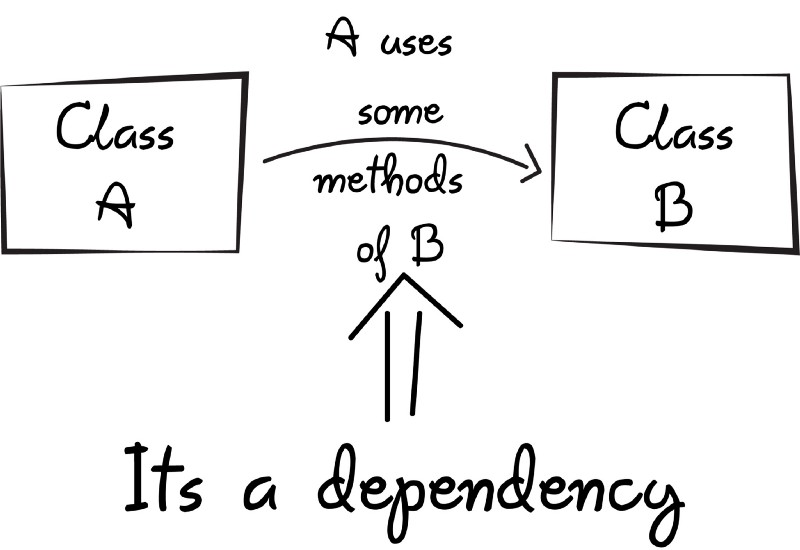
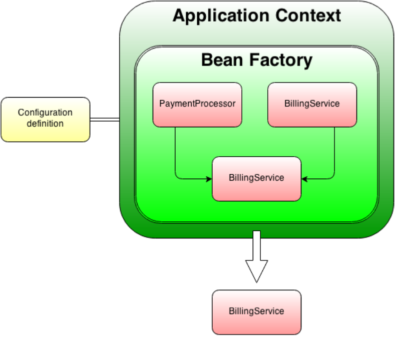

# Spring framework

**Немного истории:**
* Появился в 2003 году
* Самый популярный фреймворк (в том числе web)
* Безумно высокооплачиваемый

## Что это такое?
Состоит из компонентов, сильно упрощает разработку на java.

* Контекст приложения (*Application Context*)
* Эффективный, удобный доступ к БД
* Компонент для разработки web (*Spring MVC*)
* Много другоих компонентов

## Application Context, Dependency injection

Проблема: в java много объектов, между ними есть зависимости - они ссылаются друг на друга.

Пример использования терминологии: "*Внутри объекта A есть ссылка на объект B*" = "*A зависит от B*". В графе из объектов тогда обычно рисуют стрелку из A в B.



При запуске приложения все классы создаются. В ходе работы они могут удаляться или создаваться.

**Каноничные примеры:**
```java
class Car {
  Wheel wheels[4];
  Engine engine;
  // коробка передач:
  Transmission transmission;
}
```

То есть придется очень много раз писать `new` (здесь: 7 раз).

Код становиться очень запутанным.

Второй пример - *singletone*, например объект отвечающий за базу данных.

```java
class Database {}
class User {
  // using Database
}
class Util {
  // using Database
}
class WebForm {
  // using Database
}
```

То есть нужно *внедрить* ссылку на базу данных во все эти объекты.

Для этого потребовалось бы запариться с кодом, это реально, но со Spring это делается быстро.

## Как Spring решает эти проблемы

Есть *application*, внутри него есть *aplication context*. Spring создает все классы внутри aplication context и внедряет все необходимые зависимости (*dependency injection*), то есть у всех объектах есть ссылки на объекты, от которых они зависят.

## Важные идейные ремарки
Базы данных есть почти везде. Использование хоть сколько-нибкдь низкоуровневых библиотек (например *JDBC*) - очень запарно. Со Spring это становится просто.

*Spring MVC* - web-framework используется для создания web-приложений (backend API). Существует *Java EE Servlets*, но он просто хуже, чем *Spring MVC*.

## Некоторые компоненты Spring framework
* *Spring Security* - обезопашивание приложения (аутентификация и тп)
* Spring Boot - для запуска.
* Spring Webflow
* 


