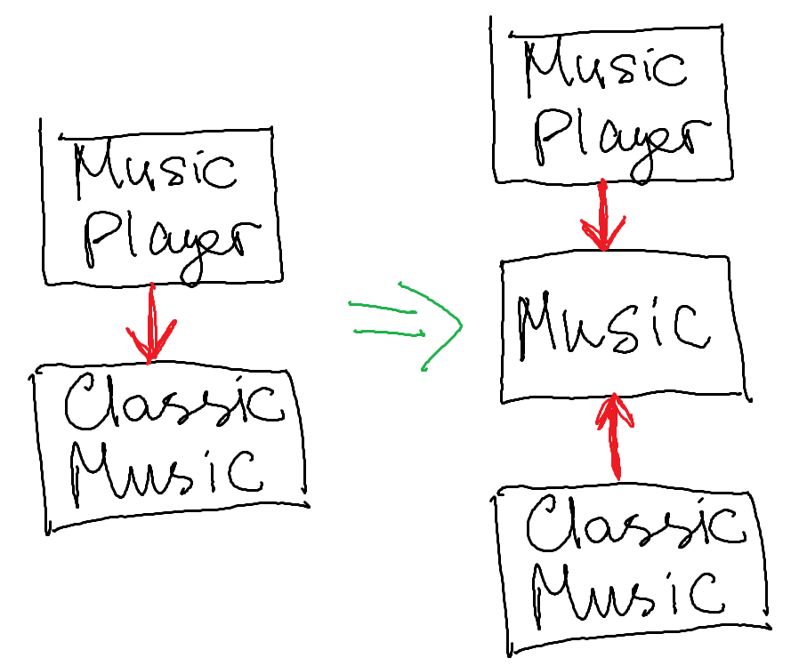

# Инверсия управления

[PVS-Studio](https://pvs-studio.ru/ru/pvs-studio/) - очень прошаренный статический анализатор, который даже в очень серьезных проектах находил ошибки.

**Пример появления зависимости:**
```java
class ClassicMusic {}
class MusicPlayer {
  private ClassicMusic classicMusic;
  public void playMusic() {
    classicMusic = new ClassicMusic;
    // ...
  }
}
```

Почему это проблема:
* (1) MusicPlayer *сильно зависит* от ClassicMusic - то есть заточен на работу только с ним. Решением может служить создание интерфейса либо абстрактного класса, то есть используем полиморфизм.

```java
interface Music {}
class ClassicMusic implements Music {}
class RockMusic implements Music {}
class MusicPlayer {
  private Music music;
  public void playMusic() {
    music = new ClassicMusic;
    // or 
    music = new RockMusic;
    // ...
  }
}
```

* (2) Объекты создаются вручную - это хочется делать в конфигурационном файле.

## Bean
... - просто java объект, созданный спрингом.
Пример создания:
```xml
<bean id="someId"
    class="path.path.TestBean">
    <constructor-arg value="Value"/>
</bean>
```

## Сильная и слабая зависимости
Сильная (*Tight Coupling*) подразумевает тесную связь между объектами и изменение одного объекта скорее всего потребует изменений и во втором - это плохо для гибкости приложений.

Слабая (*Loose Coupling*) подразумевает что объекты связаны, но взаимодействуют друг с другом через абстракции, например, интерфейс.

Собственно см. 2 примера выше.

В качестве вывода: создавайте классы, но храните их как интерфейсы. Например,
```java
List<Integer> l = new ArrayList<Integer>();
```

* (3) MusicPlayer сам создает свои зависимости (слабо зависит от Music) - это неправильно, так как это противоречит принципу *IoC* = *Inversion of Control*.

## Принцип инверсии управления
... - архитектурный паттерн, подразумевающий, что сущность не сама создает зависимости, а *наоборот* - зависимости поставляются ей извне. Вот пример:

```java
class MusicPlayer {
  private Music music;
  public void playMusic() {
    // no creation, just usage of methods
  }
}
```

Класс MusicPlayer зависит от Music. Мы хотим как бы передавать какой класс надо создать.

**Картинка преобразилась:**


* (4) Объект, который нужно передать MusicPlayer, все же где-то надо передать:
```java
public static void main() {
  var mp = new MusicPlayer(new ClassicMusic());
}
```

## Тестовый проект (продолжение)
Конфигурировать с помощью xml - старый способ. Современное решение состоит в прописывании *аннотаций*, причем либо c небольшим количеством xml, либо и вовсе без него.

То есть возможно все конфигурации можно писать чисто в коде Java.

