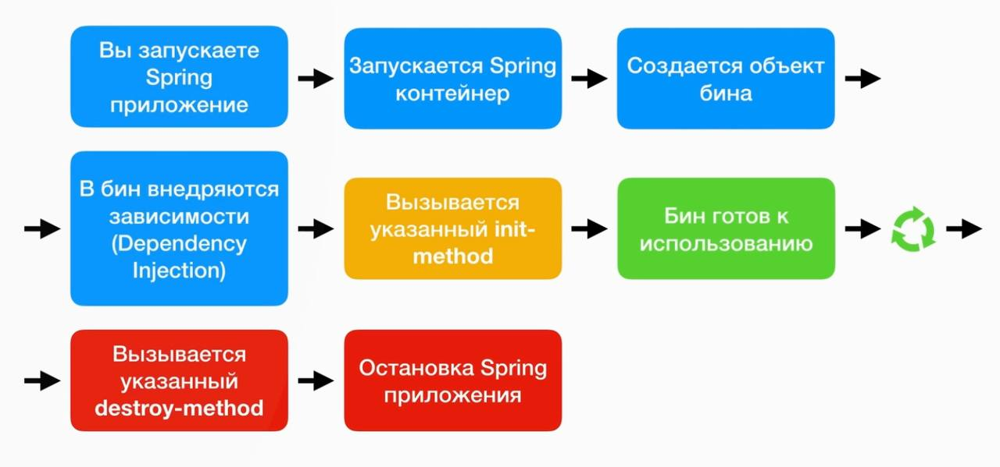

# Про бины
## Bean Scopes
**1) Singletone**. Он по-умолчанию.
При вызове `getBean` возвращается один и тот же объект из *Spring Application Context*.

Обычно *singletone* используется когда у бина нет изменяемых состояний (*stateless*).

Можно в описании `bean` уточнить *singletone* (не обязательно):
```xml
<bean id="..."
      class="..."
      scope="singletone"> 
</bean>
```

**2) Prototype**. При вызове `getBean` каждый раз создается новый объект.

**3) Прочие**
* *request*
* *session*
* *global-session*

## Init-method, destroy-method
У бинов можно указать *init* и *destroy* методы. Они будут вызваны до начала программы и, соответственно, после.

Вот жизненный цикл бинов (*bean lifecycle*):


**Нюансы:**
* Имя метода не авжно
* private/public/protected/... - не важно
* Не должно быть аргументов
* Возвращаемое значение - любое, но нет возможности получить его значение, поэтому уместнее писать `void`.
* Если scope у бина *prototype*, то не будут вызываться *destroy*-методы, по понятным причинам (потому же почему в java нет деструкторов).

## Фабричный метод
Это паттерн програмирования.
Можно создавать объекты не напрямую (через `new`), а через специальный метод.

В Spring это можно реализовать так:
```xml
<bean id="..."
      class="..."
      factory-method="getMyClass"> 
</bean>
```
где `getMyClass` - статический метод данного класса.