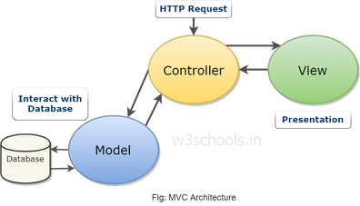

# Spring MVC

Архитектура Model View Controller - паттерн проектирования web приложений.

DispatcherServlet - стартовая точка программы.
Реализован за программиста.

Запрос попадает в него, он отправляет его на нужный контроллер.

Контроллер помечается `@Controller`. Обрабатывает запросы (с точки зрения разработчика)

Модель взаимодействует с базами данных. Помечается `@Entity`.

